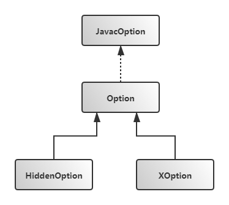

# com.sun.tools.javac.main.JavacOption

> **举例: "-varnunchecked"命令表示对泛型的非检查异常给出警告，"-fullversion"命令打印完整的版本信息等。**
>
> **每个Javac命令都用`JavacOption`对象表示。`JavacOption`接口中定义了对命令的常见操作：**

```java
public interface JavacOption {
    OptionKind getKind(); //命令类型
    boolean hasArg();     //命令后是否有相关参数
    boolean matches(String arg); //传入的命令是否与当前命令匹配
    boolean process(Options options, String option, String arg); //执行命令, 有参数
    boolean process(Options options, String option);             //执行命令, 无参数
}
```

## JavacOption继承体系



### 1. JavacOption的基础实现，标准选项: Option

```java
static class Option implements JavacOption {

        OptionName name; //Option string; option选项字符串, 命令行选项名;
  
        String argsNameKey; //Documentation key for arguments; 文档显示选项字符串名

        String descrKey; //Documentation key for description; 文档显示选项描述
 
        boolean hasSuffix; //Suffix option (-foo=bar or -foo:bar); name以'-'或':'结尾且argsNameKey非null时, 本字段值为true

        ChoiceKind choiceKind; //The kind of choices for this option, if any; 

        Map<String,Boolean> choices; //The choices for this option, if any, and whether or not the choices are hidden

        Option(OptionName name, String argsNameKey, String descrKey) {
            this.name = name;
            this.argsNameKey = argsNameKey;
            this.descrKey = descrKey;
            char lastChar = name.optionName.charAt(name.optionName.length()-1);
            hasSuffix = lastChar == ':' || lastChar == '=';
        }

        Option(OptionName name, String descrKey) {
            this(name, null, descrKey);
        }

        Option(OptionName name, String descrKey, ChoiceKind choiceKind, String... choices) {
            this(name, descrKey, choiceKind, createChoices(choices));
        }

        private static Map<String,Boolean> createChoices(String... choices) { //构建choices map
            Map<String,Boolean> map = new LinkedHashMap<String,Boolean>();
            for (String c: choices)
                map.put(c, false);
            return map;
        }

        Option(OptionName name, String descrKey, ChoiceKind choiceKind, Map<String,Boolean> choices) {
            this(name, null, descrKey);
            if (choiceKind == null || choices == null)
                throw new NullPointerException();
            this.choiceKind = choiceKind;
            this.choices = choices;
        }

        @Override public String toString() {
            return name.optionName;
        }

    	//是否有参数, 如果hasSuffix为true时, 参数直接跟在':'/'='后面, 所以没有参数
        //如果argsNameKey为null时也没有参数
        public boolean hasArg() { 
            return argsNameKey != null && !hasSuffix;
        }

        public boolean matches(String option) {
            if (!hasSuffix)
                return option.equals(name.optionName);

            if (!option.startsWith(name.optionName))
                return false;

            if (choices != null) {
                String arg = option.substring(name.optionName.length());
                if (choiceKind == ChoiceKind.ONEOF)
                    return choices.keySet().contains(arg);
                else {
                    for (String a: arg.split(",+")) {
                        if (!choices.keySet().contains(a))
                            return false;
                    }
                }
            }

            return true;
        }

        /** Print a line of documentation describing this option, if standard.
         * @param out the stream to which to write the documentation
         */
        void help(PrintWriter out) {
            String s = "  " + helpSynopsis();
            out.print(s);
            for (int j = Math.min(s.length(), 28); j < 29; j++) out.print(" ");
            Log.printLines(out, Main.getLocalizedString(descrKey));
        }

        String helpSynopsis() {
            StringBuilder sb = new StringBuilder();
            sb.append(name);
            if (argsNameKey == null) {
                if (choices != null) {
                    String sep = "{";
                    for (Map.Entry<String,Boolean> e: choices.entrySet()) {
                        if (!e.getValue()) {
                            sb.append(sep);
                            sb.append(e.getKey());
                            sep = ",";
                        }
                    }
                    sb.append("}");
                }
            } else {
                if (!hasSuffix)
                    sb.append(" ");
                sb.append(Main.getLocalizedString(argsNameKey));
            }

            return sb.toString();
        }

        /** Print a line of documentation describing this option, if non-standard.
         *  @param out the stream to which to write the documentation
         */
        void xhelp(PrintWriter out) {}

        /** Process the option (with arg). Return true if error detected.
         */
        public boolean process(Options options, String option, String arg) {
            if (options != null) {
                if (choices != null) {
                    if (choiceKind == ChoiceKind.ONEOF) {
                        // some clients like to see just one of option+choice set
                        for (String s: choices.keySet())
                            options.remove(option + s);
                        String opt = option + arg;
                        options.put(opt, opt);
                        // some clients like to see option (without trailing ":")
                        // set to arg
                        String nm = option.substring(0, option.length() - 1);
                        options.put(nm, arg);
                    } else {
                        // set option+word for each word in arg
                        for (String a: arg.split(",+")) {
                            String opt = option + a;
                            options.put(opt, opt);
                        }
                    }
                }
                options.put(option, arg);
            }
            return false;
        }

        /** Process the option (without arg). Return true if error detected.
         */
        public boolean process(Options options, String option) {
            if (hasSuffix)
                return process(options, name.optionName, option.substring(name.optionName.length()));
            else
                return process(options, option, option);
        }

        public OptionKind getKind() { return OptionKind.NORMAL; } //Option代表标准选项, 所以getKind()返回NORMAL

        public OptionName getName() { return name; }
    };
```

### 2.  非标准选项: XOption

```java
static class XOption extends Option {
        XOption(OptionName name, String argsNameKey, String descrKey) {
            super(name, argsNameKey, descrKey);
        }
        XOption(OptionName name, String descrKey) {
            this(name, null, descrKey);
        }
        XOption(OptionName name, String descrKey, ChoiceKind kind, String... choices) {
            super(name, descrKey, kind, choices);
        }
        XOption(OptionName name, String descrKey, ChoiceKind kind, Map<String,Boolean> choices) {
            super(name, descrKey, kind, choices);
        }
        @Override
        void help(PrintWriter out) {}
        @Override
        void xhelp(PrintWriter out) { super.help(out); }
        @Override
        public OptionKind getKind() { return OptionKind.EXTENDED; } //非标准选项, 所以getKind()返回EXTENDED
};
```

### 3. 内部选项：HiddenOption

```java
static class HiddenOption extends Option {
        HiddenOption(OptionName name) {
            super(name, null, null);
        }
        HiddenOption(OptionName name, String argsNameKey) {
            super(name, argsNameKey, null);
        }
        @Override
        void help(PrintWriter out) {}
        @Override
        void xhelp(PrintWriter out) {}
        @Override
        public OptionKind getKind() { return OptionKind.HIDDEN; } //返回HIDDEN
    };
```

## 命令类型 OptionKind

> **Javac本身支持的命令很多，通常编译器对外提供的命令可以分为标准和非标准两个类型，非标准选项以`-X`开头。**
>
> **但Javac内部却将命令分为三类，通过枚举类`OptionKind`来表示：**

```java
enum OptionKind {
    NORMAL, //标准选项
    EXTENDED, //非标准选项
    HIDDEN, //Javac内部使用的选项
}
```

## 命令选项字符串枚举：OptionName

```java
public enum OptionName { //com.sun.tools.javac.main.OptionName
    G("-g"),
    G_NONE("-g:none"),
    G_CUSTOM("-g:"),
    XLINT("-Xlint"),
    XLINT_CUSTOM("-Xlint:"),
    DIAGS("-XDdiags="),
    NOWARN("-nowarn"),
    VERBOSE("-verbose"),
    DEPRECATION("-deprecation"),
    CLASSPATH("-classpath"),
    CP("-cp"),
    SOURCEPATH("-sourcepath"),
    BOOTCLASSPATH("-bootclasspath"),
    XBOOTCLASSPATH_PREPEND("-Xbootclasspath/p:"),
    XBOOTCLASSPATH_APPEND("-Xbootclasspath/a:"),
    XBOOTCLASSPATH("-Xbootclasspath:"),
    EXTDIRS("-extdirs"),
    DJAVA_EXT_DIRS("-Djava.ext.dirs="),
    ENDORSEDDIRS("-endorseddirs"),
    DJAVA_ENDORSED_DIRS("-Djava.endorsed.dirs="),
    PROC("-proc:"),
    PROCESSOR("-processor"),
    PROCESSORPATH("-processorpath"),
    D("-d"),
    S("-s"),
    IMPLICIT("-implicit:"),
    ENCODING("-encoding"),
    SOURCE("-source"),
    TARGET("-target"),
    VERSION("-version"),
    FULLVERSION("-fullversion"),
    HELP("-help"),
    A("-A"),
    X("-X"),
    J("-J"),
    MOREINFO("-moreinfo"),
    WERROR("-Werror"),
    COMPLEXINFERENCE("-complexinference"),
    PROMPT("-prompt"),
    DOE("-doe"),
    PRINTSOURCE("-printsource"),
    WARNUNCHECKED("-warnunchecked"),
    XMAXERRS("-Xmaxerrs"),
    XMAXWARNS("-Xmaxwarns"),
    XSTDOUT("-Xstdout"),
    XPKGINFO("-Xpkginfo:"),
    XPRINT("-Xprint"),
    XPRINTROUNDS("-XprintRounds"),
    XPRINTPROCESSORINFO("-XprintProcessorInfo"),
    XPREFER("-Xprefer:"),
    O("-O"),
    XJCOV("-Xjcov"),
    XD("-XD"),
    AT("@"),
    SOURCEFILE("sourcefile");

    public final String optionName;

    OptionName(String optionName) {
        this.optionName = optionName;
    }
    
    @Override
    public String toString() {
        return optionName;
    }
}
```

## ChoiceKind

```java
enum ChoiceKind {
    ONEOF,
    ANYOF
}
```

# RecognizedOptions

> **`RecognizedOptions#getAll()`获取当前支持的所有Javac选项.**
>
> **代码中创建了很多Option及其子类实例，这里选了比较典型的`-d`和`sourcefile`命令的实现.**

```java
/**
   * Get all the recognized options.
   * @param helper an {@code OptionHelper} to help when processing options
   * @return an array of options
   */
public static Option[] getAll(final OptionHelper helper) {
        return new Option[] {
        //...
        new Option(D,                   "opt.arg.directory",    "opt.d"),
        
        //...
        new HiddenOption(SOURCEFILE) { 
            String s;
            //本命令重写了matches方法, 只要参数是以.java后缀或合法的文件名,
            //则返回true
            @Override public boolean matches(String s) { 
                this.s = s;
                return s.endsWith(".java")  // Java source file
                    || SourceVersion.isName(s);   // Legal type name
            }
            @Override public boolean process(Options options, String option) {
                if (s.endsWith(".java") ) {
                    File f = new File(s);
                    if (!f.exists()) {
                        helper.error("err.file.not.found", f);
                        return true;
                    }
                    if (!f.isFile()) {
                        helper.error("err.file.not.file", f);
                        return true;
                    }
                    helper.addFile(f);
                }
                else
                    helper.addClassName(s);
                return false;
            }
        },
        };
}
        
```

## com.sun.tools.javac.main.Main对命令行参数的处理

```java
//以"javac -d /tmp/ a.java"为例, 当执行到 processArgs(flags)时, flags数组中包含 "-d" "/tmp/" "a.java" 三个字符串
//需要理解对"-d" Option的处理逻辑以及
//对SOURCEFILE Option的的处理逻辑
public List<File> processArgs(String[] flags) { // Main.java
        int ac = 0;
        while (ac < flags.length) { //遍历flags
            String flag = flags[ac];
            ac++;

            Option option = null;

            if (flag.length() > 0) {
                //如果flag以"-"开头, 表示为选项, 则到recognizedOptions中调用matches来测试是哪个option
                //从而获取到Option对象;
                
                //对于非'-'开头的命令, 则直接使用recognizedOptions数组中的最后一个Option进行测试
                //而recognizedOptions的最后一个Option是 HiddenOption(SOURCEFILE),参考上一节
                //根据SOURCEFILE Option的matches方法, 则"a.java"可以通过测试
                //进一步看一下SOURCEFILE Option的process方法, 再结合recognizedOptions数组的定义,
                //则对于Main类来说, 它是将"a.java" 添加到了成员变量 ListBuffer<File> filenames 中;
                int firstOptionToCheck = flag.charAt(0) == '-' ? 0 : recognizedOptions.length-1;
                for (int j=firstOptionToCheck; j<recognizedOptions.length; j++) {
                    if (recognizedOptions[j].matches(flag)) {
                        option = recognizedOptions[j];
                        break;
                    }
                }
            }

            if (option == null) {
                error("err.invalid.flag", flag);
                return null;
            }

            if (option.hasArg()) { 
                if (ac == flags.length) {
                    error("err.req.arg", flag);
                    return null;
                }
                String operand = flags[ac];
                ac++;
                if (option.process(options, flag, operand)) //有参数时调用方法
                    return null;
            } else {
                if (option.process(options, flag)) //没有参数时的调用方法
                    return null;
            }
        }

        if (!checkDirectory(D))
            return null;
        if (!checkDirectory(S))
            return null;

        String sourceString = options.get(SOURCE);
        Source source = (sourceString != null)
            ? Source.lookup(sourceString)
            : Source.DEFAULT;
        String targetString = options.get(TARGET);
        Target target = (targetString != null)
            ? Target.lookup(targetString)
            : Target.DEFAULT;
        // We don't check source/target consistency for CLDC, as J2ME
        // profiles are not aligned with J2SE targets; moreover, a
        // single CLDC target may have many profiles.  In addition,
        // this is needed for the continued functioning of the JSR14
        // prototype.
        if (Character.isDigit(target.name.charAt(0))) {
            if (target.compareTo(source.requiredTarget()) < 0) {
                if (targetString != null) {
                    if (sourceString == null) {
                        warning("warn.target.default.source.conflict",
                                targetString,
                                source.requiredTarget().name);
                    } else {
                        warning("warn.source.target.conflict",
                                sourceString,
                                source.requiredTarget().name);
                    }
                    return null;
                } else {
                    target = source.requiredTarget();
                    options.put("-target", target.name);
                }
            } else {
                if (targetString == null && !source.allowGenerics()) {
                    target = Target.JDK1_4;
                    options.put("-target", target.name);
                }
            }
        }

        // handle this here so it works even if no other options given
        String showClass = options.get("showClass");
        if (showClass != null) {
            if (showClass.equals("showClass")) // no value given for option
                showClass = "com.sun.tools.javac.Main";
            showClass(showClass);
        }

        return filenames.toList();
    }
```

