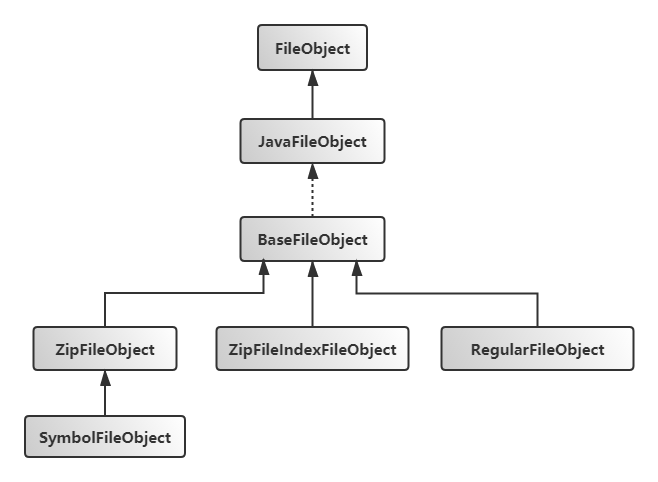
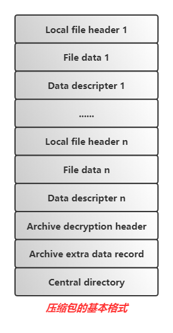
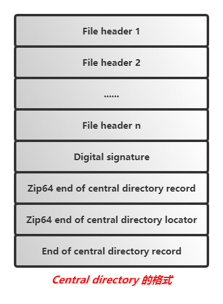

# Javac文件系统

> **Javac在编译源代码的过程中会涉及对文件及目录的操作，如，在指定路径下搜索Java源文件，读取JAR包中的Class文件，以及将编译生成的字节码写入Class文件等。Javac文件系统借助Java已有的文件API实现了满足自身业务需求相关的API，方便了对文件及目录的操作。**
>
> **Javac文件系统涉及的大部分类 存放在`com.sun.tools.javac.file`包路径下。**

## 1. 文件相关实现类

### 1. 1 相对路径、相对目录、相对路径文件 RelativePath、RelativeDirectory、RelativeFile

> **作用：读取压缩包中的内容时需要使用相对路径访问**

```java
public abstract class RelativePath implements Comparable<RelativePath> { //相对路径
    //equals、hashCode、toString、path getter 略
    
    protected final String path;
    
    protected RelativePath(String p) { //p内部必须使用'/'作为分隔符
        path = p;
    }

    //定义的抽象方法, 分别获取path中的 dirname和basename部分
    public abstract RelativeDirectory dirname();
    public abstract String basename();

    public File getFile(File directory) { //由于path表示相对路径, 获取directory下path所标识的File
        if (path.length() == 0)
            return directory;
        return new File(directory, path.replace('/', File.separatorChar));
    }

    public int compareTo(RelativePath other) {
        return path.compareTo(other.path);
    }
    
    //内部类 RelativeDirectory继承RelativePath, 表示相对目录
    public static class RelativeDirectory extends RelativePath {

        static RelativeDirectory forPackage(CharSequence packageName) {
            return new RelativeDirectory(packageName.toString().replace('.', '/'));
        }
        
        //如果p非null, 相对目录p需要以'/'结尾
        public RelativeDirectory(String p) {
            super(p.length() == 0 || p.endsWith("/") ? p : p + "/");
        }
        
        public RelativeDirectory(RelativeDirectory d, String p) {
            this(d.path + p);
        }
        
        //获取相对目录最后一个'/'前的部分,包括最后一个'/'
        @Override public RelativeDirectory dirname() {
            int l = path.length();
            if (l == 0)
                return this;
            int sep = path.lastIndexOf('/', l - 2);
            return new RelativeDirectory(path.substring(0, sep + 1));
        }
        
        @Override public String basename() {
            int l = path.length();
            if (l == 0)
                return path;
            int sep = path.lastIndexOf('/', l - 2);
            return path.substring(sep + 1, l - 1);
        }
        
        boolean contains(RelativePath other) {
            return other.path.length() > path.length() && other.path.startsWith(path);
        }
    }
    
    //内部类, 表示相对路径文件
    public static class RelativeFile extends RelativePath {
        static RelativeFile forClass(CharSequence className, JavaFileObject.Kind kind) {
            return new RelativeFile(className.toString().replace('.', '/') + kind.extension);
        }

        public RelativeFile(String p) {
            super(p);
            if (p.endsWith("/"))
                throw new IllegalArgumentException(p);
        }

        /**
         * @param p must use '/' as an internal separator
         */
        public RelativeFile(RelativeDirectory d, String p) {
            this(d.path + p);
        }

        RelativeFile(RelativeDirectory d, RelativePath p) {
            this(d, p.path);
        }

        @Override public RelativeDirectory dirname() {
            int sep = path.lastIndexOf('/');
            return new RelativeDirectory(path.substring(0, sep + 1));
        }

        @Override public String basename() {
            int sep = path.lastIndexOf('/');
            return path.substring(sep + 1);
        }

        //冷不丁来一个这方法
        ZipEntry getZipEntry(ZipFile zip) { 
            return zip.getEntry(path);
        }
    }
}
```

### 1.2 压缩包类的继承体系

> **Javac在编译源代码过程中需要操作如下几种类型的文件：**
>
> 1. **编译Java源代码，所以肯定需要读取.java结尾的文件**
>
> 2. **Java源代码涉及到依赖类，所以需要操作.class文件**
>
> 3. **.class文件大部分在压缩包中，如JAR包，所以还需要读取压缩包的内容**
>
> 4. **如果要使用JDK的rt.jar包提供的一些类库API，还会读取JAVA_HOME路径下的ct.sym文件，它也是一个压缩包**
>
>     > **不直接读取rt.jar包，是为了避免开发人员使用一些内部的API，同时也能避免代码编写者调整这些接口造成客户端代码无法运行**


> **`ZipArchive`和`ZipFileIndexArchive`两个类直接继承了`Archive`接口，该接口定义在`JavacFileManager`类中。**
>
> **`JavacFileManager`类是Javac的整个文件系统管理类，当然也管理着实现了`Archive`接口的所有压缩包类。**
>
> **通过`ZipArchive`类可以操作除`rt.jar`包外的所有Jar包，包括`ct.sym`包，`SymbolArchive`类操作`ct.sym`包。**
>
> **通常在读取非`ct.sym`包时会选择`ZipArchive`或者`ZipFileIndexArchive`类，读取`ct.sym`包时选择`SymbolArchive`或者`ZipFileIndexArchive`类。**
>
> **对于`openjdk-7`版本默认通过`ZipFileIndexArchive`类来读取压缩包。**
>
> > **可以指定`useOptimizedZip`命令的值为`false`来使用`ZipArchive`或者`SymbolArchive`类读取压缩包，这两个类在读取压缩包的过程中都使用类库API，实现起来相对简单，读取时也不用关注压缩包的西式等。而`ZipFileIndexArchive`类的读取效率相比`ZipArchive`和`SymbolArchive`这两个类更高，但是实现相对复杂。下面可能主要关注`ZipFileIndexArchive`的实现方式。**

### 1.3 压缩包内部文件相关类的继承体系

> **Javac内部的每个压缩包都是一个`ZipFileIndex`对象，而对应每个`Archive`接口的实现类中都定义了表示压缩包中具体压缩文件的静态内部类，如下图**



> **`ZipFileObject`类定义在`ZipArchive`类中**
>
> **`SymbolFileObject`类定义在`SymbolArchive`类中**
>
> **`ZipFileIndexFileObject`类定义在`ZipFileIndexArchive`类中**

> **抽象基类`BaseFileObject`中定义了针对具体文件进行操作的许多方法，如调用`getCharContent()`方法，可以获取对应文件的字符流**

> **`RegularFileObject`一般用来表示Java源文件**

### 1.4 压缩包读取实现类：ZipFileIndex

```java
public class ZipFileIndex { //com.sun.tools.javac.file.ZipFileIndex
    final File zipFile; //要读取的压缩包
    private RandomAccessFile zipRandomFile;//用zipFile构造RandomAccessFile实例
    private Entry[] entries; //解析压缩包的Entry解析结果, 包括Entry和DirectoryEntry实例
        
    private Map<RelativeDirectory, DirectoryEntry> directories =
            Collections.<RelativeDirectory, DirectoryEntry>emptyMap(); 
    
    private boolean readFromIndex = false;
    
    //缓存 path => RelativeDirectory实例 的映射关系
    private Map<String, SoftReference<RelativeDirectory>> relativeDirectoryCache =
            new HashMap<String, SoftReference<RelativeDirectory>>(); 
    
    ZipFileIndex(File zipFile, RelativeDirectory symbolFilePrefix, boolean writeIndex,
            boolean useCache, String cacheLocation) throws IOException {
        this.zipFile = zipFile;
        this.symbolFilePrefix = symbolFilePrefix; //对于ct.sym包, META-INF/sym/rt.jar/; 其余时候为null
        this.symbolFilePrefixLength = (symbolFilePrefix == null ? 0 :
            symbolFilePrefix.getPath().getBytes("UTF-8").length);
        this.writeIndex = writeIndex;
        this.usePreindexedCache = useCache; 
        this.preindexedCacheLocation = cacheLocation;

        if (zipFile != null) {
            this.zipFileLastModified = zipFile.lastModified();
        }

        // Validate integrity of the zip file
        checkIndex();
    }
    
    //重要, 读取压缩包的相关内容, 将结果缓存在directories成员变量中
    private void checkIndex() throws IOException { 
        boolean isUpToDate = true;
        if (!isUpToDate()) {
            closeFile();
            isUpToDate = false;
        }

        if (zipRandomFile != null || isUpToDate) {
            lastReferenceTimeStamp = System.currentTimeMillis();
            return;
        }

        hasPopulatedData = true;

        if (readIndex()) {
            lastReferenceTimeStamp = System.currentTimeMillis();
            return;
        }

        directories = Collections.<RelativeDirectory, DirectoryEntry>emptyMap();
        allDirs = Collections.<RelativeDirectory>emptySet();

        try {
            openFile();
            long totalLength = zipRandomFile.length();
            ZipDirectory directory = new ZipDirectory(zipRandomFile, 0L, totalLength, this);
            directory.buildIndex(); //解析压缩文件, 结果保存到entries数组中
        } finally {
            if (zipRandomFile != null) {
                closeFile();
            }
        }

        lastReferenceTimeStamp = System.currentTimeMillis();
    }
    
    //ZipFileIndexArchive#getFileObject()调用了本方法, 委派给了DirectoryEntry#getEntry
    synchronized Entry getZipIndexEntry(RelativePath path) { 
        try {
            checkIndex();
            DirectoryEntry de = directories.get(path.dirname());
            String lookFor = path.basename();
            return (de == null) ? null : de.getEntry(lookFor);
        }
        catch (IOException e) {
            return null;
        }
    }
    
    //ZipfileIndexArchive#getFiles()调用了本方法, 这里又委派给DirectoryEntry#getFiles
    public synchronized com.sun.tools.javac.util.List<String> getFiles(RelativeDirectory path) {
        try {
            checkIndex();

            DirectoryEntry de = directories.get(path);
            com.sun.tools.javac.util.List<String> ret = de == null ? null : de.getFiles();

            if (ret == null) {
                return com.sun.tools.javac.util.List.<String>nil();
            }
            return ret;
        }
        catch (IOException e) {
            return com.sun.tools.javac.util.List.<String>nil();
        }
    }      
    
    
    //---- 了解了上面 directory.buildIndex()的实现逻辑, 以及buildIndex()之后directories和entries中的结果后
    //---- 就可以理解下面的readBytes逻辑
    
    //读取Entry文件内容, ...其它readXX系方法逻辑与上面的read实现基本相似
    synchronized byte[] read(Entry entry) throws IOException {
        openFile();
        byte[] result = readBytes(entry);
        closeFile();
        return result;
    }

    //获取Entry对应的文件内容, 用byte[]表示
    private byte[] readBytes(Entry entry) throws IOException {
        byte[] header = getHeader(entry);
        int csize = entry.compressedSize; //Local File header后的压缩后的File Data长度
        byte[] cbuf = new byte[csize];
        //header+26 和 header+28 分别表示Local File header中30字节后额外的File Name和Extra Field字节长度,
        //需要跳过这些长度的字节之后才能读取 Entry对应的File Data
        zipRandomFile.skipBytes(get2ByteLittleEndian(header, 26) + get2ByteLittleEndian(header, 28));
        zipRandomFile.readFully(cbuf, 0, csize); //读取压缩后的内容到cbuf中

        // 如果 header+8 位置的2字节值为0, 表示文件内容并没有压缩, 所以直接返回cbuf即可
        if (get2ByteLittleEndian(header, 8) == 0)
            return cbuf;

        int size = entry.size; //entry.size表示未压缩的文件长度
        byte[] buf = new byte[size];
        if (inflate(cbuf, buf) != size) //调用inflate解压缩内容, 结果存储在buf中, 之后返回buf
            throw new ZipException("corrupted zip file");

        return buf;
    }
    
    private SoftReference<Inflater> inflaterRef; //java.util.zip.Inflater工具类
    
    //这里使用Jdk自带的Inflater工具类来解压缩src内容, 结果存储到dest中
    private int inflate(byte[] src, byte[] dest) {
        Inflater inflater = (inflaterRef == null ? null : inflaterRef.get());

        // construct the inflater object or reuse an existing one
        if (inflater == null)
            inflaterRef = new SoftReference<Inflater>(inflater = new Inflater(true));

        inflater.reset();
        inflater.setInput(src);
        try {
            return inflater.inflate(dest);
        } catch (DataFormatException ex) {
            return -1;
        }
    }
    
    //参考Entry以及ZipDirectory#buildIndex()方法, entry.offset是entry对应的Local file header在文件中的偏移
    //所以直接seek到entry.offset; 
    private byte[] getHeader(Entry entry) throws IOException {
        zipRandomFile.seek(entry.offset);
        byte[] header = new byte[30]; //30个字节就包含了要获取的Local file header相关信息
        zipRandomFile.readFully(header);
        //验证Local File header 前4个字节值
        if (get4ByteLittleEndian(header, 0) != 0x04034b50)
            throw new ZipException("corrupted zip file");
        //如果'General purpose bit flag'的最后一位设1, 表示当前为加密的压缩文件, 直接抛出异常
        if ((get2ByteLittleEndian(header, 6) & 1) != 0)
            throw new ZipException("encrypted zip file"); // offset 6 in the header of the ZipFileEntry
        return header;
    }
}
```

#### 1.4.1 Entry & DirectoryEntry类

> **`Entry`类和`DirectoryEntry`是`ZipFileIndex`类内定义的成员类**

```java
/*
关于Entry和DirectoryEntry实例构建参考 ZipDirectory#buildIndex()方法
*/
static class Entry implements Comparable<Entry> { //表示压缩包中的文件和目录
        public static final Entry[] EMPTY_ARRAY = {};

    	long javatime; //时间, 不知道做什么用
    
        // Directory related
        RelativeDirectory dir; //文件所在的RelativeDirectory
        boolean isDir;

        // File related
        String name; //文件名

        //---下面几个字段是从File header中读取到的信息, 参考1.4.2.1节
        int offset;  //File header中的'Offset of local header'值, 表示文件对应的local header在压缩文件中的偏移
        int size;    //File header中的'Uncompressed size', 原文件大小
        int compressedSize; //File header中的'Compressed size', 压缩后的文件大小
    	private int nativetime; //File header中的'Modified time', 文件修改时间

        public Entry(RelativePath path) {
            this(path.dirname(), path.basename());
        }

        public Entry(RelativeDirectory directory, String name) {
            this.dir = directory;
            this.name = name;
        }

        public String getName() {
            return new RelativeFile(dir, name).getPath();
        }

        public String getFileName() {
            return name;
        }

        public long getLastModified() {
            if (javatime == 0) {
                 javatime = dosToJavaTime(nativetime);
            }
            return javatime;
        }

        // based on dosToJavaTime in java.util.Zip, but avoiding the
        // use of deprecated Date constructor
        private static long dosToJavaTime(int dtime) {
            Calendar c = Calendar.getInstance();
            c.set(Calendar.YEAR,        ((dtime >> 25) & 0x7f) + 1980);
            c.set(Calendar.MONTH,       ((dtime >> 21) & 0x0f) - 1);
            c.set(Calendar.DATE,        ((dtime >> 16) & 0x1f));
            c.set(Calendar.HOUR_OF_DAY, ((dtime >> 11) & 0x1f));
            c.set(Calendar.MINUTE,      ((dtime >>  5) & 0x3f));
            c.set(Calendar.SECOND,      ((dtime <<  1) & 0x3e));
            c.set(Calendar.MILLISECOND, 0);
            return c.getTimeInMillis();
        }

        void setNativeTime(int natTime) {
            nativetime = natTime;
        }

        public boolean isDirectory() {
            return isDir;
        }

        public int compareTo(Entry other) {
            RelativeDirectory otherD = other.dir;
            if (dir != otherD) {
                int c = dir.compareTo(otherD);
                if (c != 0)
                    return c;
            }
            return name.compareTo(other.name);
        }
		//hashCode、toString、equals方法略
    }

//------ DirectoryEntry内部类
static class DirectoryEntry { //表示压缩包内的相对目录
        private boolean filesInited;
        private boolean directoriesInited;
        private boolean zipFileEntriesInited;
        private boolean entriesInited;

        private long writtenOffsetOffset = 0;

        private RelativeDirectory dirName; //相对目录

        private com.sun.tools.javac.util.List<String> zipFileEntriesFiles = com.sun.tools.javac.util.List.<String>nil();
        private com.sun.tools.javac.util.List<String> zipFileEntriesDirectories = com.sun.tools.javac.util.List.<String>nil();
        private com.sun.tools.javac.util.List<Entry>  zipFileEntries = com.sun.tools.javac.util.List.<Entry>nil();

        private List<Entry> entries = new ArrayList<Entry>(); //本目录下的所有entries, 包括子目录下的entries

        private ZipFileIndex zipFileIndex; //所在的压缩包

        private int numEntries;

        DirectoryEntry(RelativeDirectory dirName, ZipFileIndex index) {
            filesInited = false;
            directoriesInited = false;
            entriesInited = false;

            this.dirName = dirName;
            this.zipFileIndex = index;
        }

        private com.sun.tools.javac.util.List<String> getFiles() {
            if (!filesInited) {
                initEntries(); //初始化entries list之后, 遍历筛选文件型Entry添加到zipFileEntriesFiles list中即可
                for (Entry e : entries) {
                    if (!e.isDir) {
                        zipFileEntriesFiles = zipFileEntriesFiles.append(e.name);
                    }
                }
                filesInited = true;
            }
            return zipFileEntriesFiles;
        }

        private com.sun.tools.javac.util.List<String> getDirectories() {
            if (!directoriesInited) {
                initEntries();
                for (Entry e : entries) {
                    if (e.isDir) {
                        zipFileEntriesDirectories = zipFileEntriesDirectories.append(e.name);
                    }
                }
                directoriesInited = true;
            }
            return zipFileEntriesDirectories;
        }

        private com.sun.tools.javac.util.List<Entry> getEntries() {
            if (!zipFileEntriesInited) {
                initEntries();
                zipFileEntries = com.sun.tools.javac.util.List.nil();
                for (Entry zfie : entries) {
                    zipFileEntries = zipFileEntries.append(zfie);
                }
                zipFileEntriesInited = true;
            }
            return zipFileEntries;
        }

        private Entry getEntry(String rootName) { //在entries中二分查找 dirName/rootName
            initEntries();
            int index = Collections.binarySearch(entries, new Entry(dirName, rootName));
            if (index < 0) {
                return null;
            }

            return entries.get(index);
        }

        private void initEntries() { 
            if (entriesInited) {  //获取到本dirName目录下的entries之后, 再修改为true
                return;
            }

            if (!zipFileIndex.readFromIndex) { //字段默认为false,所以会进入if代码块执行
                
                //由于zipFileIndex.entries已排序, 所以可以通过二分查找法找到介于dirName/"" 和 dirName/0xffff 
                //之间的Entry索引, 从from~to; 
                int from = -Arrays.binarySearch(zipFileIndex.entries,
                        new Entry(dirName, ZipFileIndex.MIN_CHAR)) - 1;
                int to = -Arrays.binarySearch(zipFileIndex.entries,
                        new Entry(dirName, MAX_CHAR)) - 1;

                for (int i = from; i < to; i++) {
                    //将zipFileIndex的entries[from]~entries[to]的元素加入本实例的entries list中
                    entries.add(zipFileIndex.entries[i]); 
                }
            } else { 
                //调试时不会进入本代码块执行, 暂过...
                File indexFile = zipFileIndex.getIndexFile();
                if (indexFile != null) {
                    RandomAccessFile raf = null;
                    try {
                        raf = new RandomAccessFile(indexFile, "r");
                        raf.seek(writtenOffsetOffset);

                        for (int nFiles = 0; nFiles < numEntries; nFiles++) {
                            // Read the name bytes
                            int zfieNameBytesLen = raf.readInt();
                            byte [] zfieNameBytes = new byte[zfieNameBytesLen];
                            raf.read(zfieNameBytes);
                            String eName = new String(zfieNameBytes, "UTF-8");

                            // Read isDir
                            boolean eIsDir = raf.readByte() == (byte)0 ? false : true;

                            // Read offset of bytes in the real Jar/Zip file
                            int eOffset = raf.readInt();

                            // Read size of the file in the real Jar/Zip file
                            int eSize = raf.readInt();

                            // Read compressed size of the file in the real Jar/Zip file
                            int eCsize = raf.readInt();

                            // Read java time stamp of the file in the real Jar/Zip file
                            long eJavaTimestamp = raf.readLong();

                            Entry rfie = new Entry(dirName, eName);
                            rfie.isDir = eIsDir;
                            rfie.offset = eOffset;
                            rfie.size = eSize;
                            rfie.compressedSize = eCsize;
                            rfie.javatime = eJavaTimestamp;
                            entries.add(rfie);
                        }
                    } catch (Throwable t) {
                        // Do nothing
                    } finally {
                        try {
                            if (raf != null) {
                                raf.close();
                            }
                        } catch (Throwable t) {
                            // Do nothing
                        }
                    }
                }
            }

            entriesInited = true;
        }

        List<Entry> getEntriesAsCollection() {
            initEntries();

            return entries;
        }
    }
```

#### 1.4.2 ZipDirectory类

> **`ZipDirectory`类是`ZipFileIndex`类内定义的一个私有成员类，这个类中的相关方法将按照压缩包的格式从`ziprandomFile`中读取压缩包中的目录和文件，然后保存到`ZipFileIndex`类中全局私有变量`entries`和`directories`中，供其它方法查询。**

```java
private class ZipDirectory { //作用: 读取压缩文件的Central Directory部分, 并且相关信息填充ZipFileIndex的directories和entries字段
        private RelativeDirectory lastDir;
        private int lastStart;
        private int lastLen;

        byte[] zipDir; //用来存储从压缩包的Central directory部分读取的File header(s)内容
        RandomAccessFile zipRandomFile = null;
        ZipFileIndex zipFileIndex = null;

        public ZipDirectory(RandomAccessFile zipRandomFile, long start, long end, ZipFileIndex index) throws IOException {
            this.zipRandomFile = zipRandomFile;
            this.zipFileIndex = index;
            hasValidHeader();
            findCENRecord(start, end);
        }

        //验证 压缩包 文件内容前4个字符是否是 "PK34"
        private boolean hasValidHeader() throws IOException {
            final long pos = zipRandomFile.getFilePointer();
            try {
                if (zipRandomFile.read() == 'P') {
                    if (zipRandomFile.read() == 'K') {
                        if (zipRandomFile.read() == 0x03) {
                            if (zipRandomFile.read() == 0x04) {
                                return true;
                            }
                        }
                    }
                }
            } finally {
                zipRandomFile.seek(pos); //由于只是验证前4个字符, 所以验证完毕后还需要将pos重置到文件开头位置
            }
            throw new ZipFormatException("invalid zip magic");
        }

        //读取zip文件的 central directory; 具体细节可参考 jdk源码中的zip_util.c#readCEN函数;
        private void findCENRecord(long start, long end) throws IOException {
            long totalLength = end - start; //压缩文件总字节数
            int endbuflen = 1024;
            byte[] endbuf = new byte[endbuflen]; //缓冲区
            long endbufend = end - start;

            //参考下面1.4.2.1 End of central directory record的格式, 它最小也是22字节, 所以压缩文件大小必须大于22字节
            while (endbufend >= 22) { 
                //下面代码读取压缩包的
                //1. 如果压缩文件长度大于1024字节, 则读取最后1024字节到endbuf数组中
                //2. 如果压缩文件长度小于1024字节, 则读取全部文件内容到endbuf数组中
                if (endbufend < endbuflen) 
                    endbuflen = (int)endbufend;
                long endbufpos = endbufend - endbuflen;
                zipRandomFile.seek(start + endbufpos);
                zipRandomFile.readFully(endbuf, 0, endbuflen);
                
                //参考下面1.4.2.1 End of central directory record的格式, 
                //由于它可能存在可选的'Comment length'个字节的 'ZIP file comment', 
                //所以需要从 (endbuflen-22) 处往前找 'Signature'的开头, 
                //验证方式是找'0x50/0x4b/0x05/0x06'连续的四个字节,并且需要满足 'endbufpos+i+22'+(Comment length字节数)==压缩文件大小
                int i = endbuflen - 22;
                while (i >= 0 &&
                        !(endbuf[i] == 0x50 &&
                        endbuf[i + 1] == 0x4b &&
                        endbuf[i + 2] == 0x05 &&
                        endbuf[i + 3] == 0x06 &&
                        endbufpos + i + 22 +
                        get2ByteLittleEndian(endbuf, i + 20) == totalLength)) {
                    i--;
                }

                //如果i>=0, 此时 i 是"End of central directory record"开头的 Signature 索引值
                if (i >= 0) {
                    //为zipDir字节数组分配空间, i+12指向的是4字节值"Central directory size"; 
                    //另外多分配了 2字节空间, 因为zipDir需要在前2个字节保存"Central directory"中的"File header"entry个数
                    zipDir = new byte[get4ByteLittleEndian(endbuf, i + 12) + 2];
                    
                    //zipDir前两个字节保存 "Total entries"
                    zipDir[0] = endbuf[i + 10];
                    zipDir[1] = endbuf[i + 11];
                    
                    //"Offset of cd with starting disk"存储的是相对于整个压缩包来说, "Central Directory"的偏移量
                    int sz = get4ByteLittleEndian(endbuf, i + 16);
                    
                    // a negative offset or the entries field indicates a potential zip64 archive
                    if (sz < 0 || get2ByteLittleEndian(zipDir, 0) == 0xffff) {
                        throw new ZipFormatException("detected a zip64 archive");
                    }
                    
                    //将Central directory中的数据全部读取到zipDir中, 其中的"Ffile header"数据需要等到之后再处理
                    zipRandomFile.seek(start + sz);
                    zipRandomFile.readFully(zipDir, 2, zipDir.length - 2);
                    return;
                } else {
                    endbufend = endbufpos + 21;
                }
            }
            throw new ZipException("cannot read zip file");
        }

        //解析findCENRecord方法中读取的Central Directory数据, 存储在zipDir数组中
        private void buildIndex() throws IOException {
            int entryCount = get2ByteLittleEndian(zipDir, 0); //获取2字节的File Header Entry数量

            // Add each of the files
            if (entryCount > 0) {
                directories = new HashMap<RelativeDirectory, DirectoryEntry>(); //初始化ZipFileIndex#directories为空
                ArrayList<Entry> entryList = new ArrayList<Entry>();
                int pos = 2;
                for (int i = 0; i < entryCount; i++) {
                    //解析File Header Entry, 相关信息存储到entryList和directories集合中
                    pos = readEntry(pos, entryList, directories);
                }

                // Add the accumulated dirs into the same list
                for (RelativeDirectory d: directories.keySet()) {
                    // use shared RelativeDirectory objects for parent dirs
                    RelativeDirectory parent = getRelativeDirectory(d.dirname().getPath());
                    String file = d.basename();
                    Entry zipFileIndexEntry = new Entry(parent, file); //用目录的父目录和目录名构建Entry
                    zipFileIndexEntry.isDir = true; //由于是目录, 所以isDir设置为true
                    entryList.add(zipFileIndexEntry); 
                }

                entries = entryList.toArray(new Entry[entryList.size()]);
                Arrays.sort(entries); //结果存储到ZipFileIndex#entries数组, ZipFileIndex#entries中包含文件和目录型Entry
            } else {
                cleanupState();  //如果File Header Entry数量为0, 则将ZipFileIndex中的相关集合置为空
            }
        }

        //解析Central Directory中一条File Header Entry数据; pos为当前File Header偏移量; 返回值为下一条File Header的偏移量
        private int readEntry(int pos, List<Entry> entryList, Map<RelativeDirectory, DirectoryEntry> directories) throws IOException {
            
            if (get4ByteLittleEndian(zipDir, pos) != 0x02014b50) { //判断'Signature'序列
                throw new ZipException("cannot read zip file entry");
            }

            int dirStart = pos + 46; //File Header中的File Name开始偏移量
            int fileStart = dirStart; //用于跟踪File Name中的文件名开始偏移量, 用dirStart初始化
            
            //pos+28 指向 File Name字符串长度, 所以fileEnd指向'File Name'结尾, 'Extra Field'开头处
            int fileEnd = fileStart + get2ByteLittleEndian(zipDir, pos + 28);

            //如果读取的是ct.sym包中的内容, 在生成压缩包时会在压缩文件路径前增加'META-INF/sym/rt.jar/'
            //以标识其特殊性; 所以在处理ct.sym包时,需要过滤掉特殊的路径 'META-INF/sym/rt.jar/'
            if (zipFileIndex.symbolFilePrefixLength != 0 && ((fileEnd - fileStart) >= symbolFilePrefixLength)) {
                dirStart += zipFileIndex.symbolFilePrefixLength;
               fileStart += zipFileIndex.symbolFilePrefixLength;
            }
            //将File Name中的'\\'替换成'/', 由于fileStart跟踪文件名开始偏移量,
            //所以每次遇到'/'或'\\'时, 将fileStart指向'/'或'\\'符号后
            for (int index = fileStart; index < fileEnd; index++) {
                byte nextByte = zipDir[index];
                if (nextByte == (byte)'\\') {
                    zipDir[index] = (byte)'/';
                    fileStart = index + 1;
                } else if (nextByte == (byte)'/') {
                    fileStart = index + 1;
                }
            }

            RelativeDirectory directory = null;
            if (fileStart == dirStart) //如果fileStart==dirStart, 表示只有一个文件名, 则directory应该是""
                directory = getRelativeDirectory(""); //先尝试从directories缓存中获取实例, 如果没有的话再创建新实例
            else if (lastDir != null && lastLen == fileStart - dirStart - 1) {
                int index = lastLen - 1;
                while (zipDir[lastStart + index] == zipDir[dirStart + index]) {
                    if (index == 0) {
                        directory = lastDir; //如果当前文件的relativeDirectory和上一次解析的路径相同, 则直接赋值lastDir
                        break;
                    }
                    index--;
                }
            }

            //将与目录信息添加到directories map中
            if (directory == null) { // Sub directories
                // lastDir、lastStart、lastLen用于缓存上一次读取的文件所在的RelativeDirectory信息;
                lastStart = dirStart; 
                lastLen = fileStart - dirStart - 1;
                directory = getRelativeDirectory(new String(zipDir, dirStart, lastLen, "UTF-8"));
                lastDir = directory;

                RelativeDirectory tempDirectory = directory;//用当前directory赋值tempDirectory

                //从tempDirectory到它的父目录直到最上层的父目录, 都往directories map中
                //添加tempDirectory => zipFileIndex 的映射关系
                while (directories.get(tempDirectory) == null) {
                    directories.put(tempDirectory, new DirectoryEntry(tempDirectory, zipFileIndex));
                    if (tempDirectory.path.indexOf("/") == tempDirectory.path.length() - 1)
                        break;
                    else {
                        tempDirectory = getRelativeDirectory(tempDirectory.dirname().getPath()); //获取父目录
                    }
                }
            }
            else {
                if (directories.get(directory) == null) { //如果directory非null, 但在directories没有它的key, 则添加
                    directories.put(directory, new DirectoryEntry(directory, zipFileIndex));
                }
            }

            // For each dir create also a file
            if (fileStart != fileEnd) {
                Entry entry = new Entry(directory,
                        new String(zipDir, fileStart, fileEnd - fileStart, "UTF-8"));

                entry.setNativeTime(get4ByteLittleEndian(zipDir, pos + 12));//Modified Time
                entry.compressedSize = get4ByteLittleEndian(zipDir, pos + 20); //压缩后大小
                entry.size = get4ByteLittleEndian(zipDir, pos + 24);           //文件原大小
                //文件相应的local header在整个压缩文件中的偏移量
                entry.offset = get4ByteLittleEndian(zipDir, pos + 42);         
                entryList.add(entry); //将文件相对应的Entry添加到entryList
            }

            return pos + 46 +
                    get2ByteLittleEndian(zipDir, pos + 28) +
                    get2ByteLittleEndian(zipDir, pos + 30) +
                    get2ByteLittleEndian(zipDir, pos + 32); //返回下一个File header偏移量
        }
    }
```

##### 1.4.2.1 压缩包以及其Central directory(中央目录)的格式

> **Central directory(中央目录)的内容，处在文件末尾**
>
>  

> **Local File Header格式：**
>
> | **Offset** | **Bytes** | **Description**                                              |
> | :--------- | :-------- | :----------------------------------------------------------- |
> | **0**      | **4**     | **Local file header signature # 0x04034b50 (read as a little-endian number)** |
> | **4**      | **2**     | **Version needed to extract (minimum)**                      |
> | **6**      | **2**     | **General purpose bit flag**                                 |
> | **8**      | **2**     | **Compression method**                                       |
> | **10**     | **2**     | **File last modification time**                              |
> | **12**     | **2**     | **File last modification date**                              |
> | **14**     | **4**     | **CRC-32**                                                   |
> | **18**     | **4**     | **Compressed size**                                          |
> | **22**     | **4**     | **Uncompressed size**                                        |
> | **26**     | **2**     | **File name length (n)**                                     |
> | **28**     | **2**     | **Extra field length (m)**                                   |
> | **30**     | **n**     | **File Name**                                                |
> | **30+n**   | **m**     | **Extra Field**                                              |

> **File header的格式**
>
> **`Signature`为: `0x50\0x4b\0x01\0x02`**
>
> 
>
> | ***Offset*** | ***Bytes*** | ***Description***                                            |
> | :----------- | :---------- | :----------------------------------------------------------- |
> | ***0***      | ***4***     | ***Central directory file header signature # 0x02014b50***   |
> | ***4***      | ***2***     | ***Version made by***                                        |
> | ***6***      | ***2***     | ***Version needed to extract (minimum)***                    |
> | ***8***      | ***2***     | ***General purpose bit flag***                               |
> | ***10***     | ***2***     | ***Compression method***                                     |
> | ***12***     | ***2***     | ***File last modification time***                            |
> | ***14***     | ***2***     | ***File last modification date***                            |
> | ***16***     | ***4***     | ***CRC-32***                                                 |
> | ***20***     | ***4***     | ***Compressed size***                                        |
> | ***24***     | ***4***     | ***Uncompressed size***                                      |
> | ***28***     | ***2***     | ***File name length (n)***                                   |
> | ***30***     | ***2***     | ***Extra field length (m)***                                 |
> | ***32***     | ***2***     | ***File comment length (k)***                                |
> | ***34***     | ***2***     | ***Disk number where file starts***                          |
> | ***36***     | ***2***     | ***Internal file attributes***                               |
> | ***38***     | ***4***     | ***External file attributes***                               |
> | ***42***     | ***4***     | ***Relative offset of local file header. This is the number of bytes between the start of the first disk on which the file occurs, and the start of the local file header. This allows software reading the central directory to locate the position of the file inside the ZIP file.*** |
> | ***46***     | ***n***     | ***File name***                                              |
> | ***46+n***   | ***m***     | ***Extra field***                                            |
> | ***46+n+m*** | ***k***     | ***File comment***                                           |

> **End of central directory record的格式：**
>
> **`Signature`四字节为 `0x50\0x4b\0x05\0x06`**
>
> 
>
> **End of central directory record的`Total entries`记录了在Central directory中压缩条目的总数，而`Central directory size`表示中央目录区的字节数大小**

### 1.5 ZipFileIndexArchive实现

```java
//按ZipFileIndexArchive实现, 它将压缩包的相关操作都委派给了ZipFileIndex类型的zfIndex字段, 所以压缩包操作是由ZipFileIndex实现的
//而通过ZipFilIndex获取压缩包内的文件返回的是 ZipFileIndex.Entry 类型对象
//在 getFileObject() 方法实现中使用 ZipFileIndex.Entry 构造了一个ZipFileIndexFileObject对象并返回 
public class ZipFileIndexArchive implements Archive { //com.sun.tools.javac.file.ZipFileIndexArchive

    private final ZipFileIndex zfIndex; //保存具体的压缩包, 每个压缩包都是一个ZipFileIndex对旬
    private JavacFileManager fileManager;

    public ZipFileIndexArchive(JavacFileManager fileManager, ZipFileIndex zdir) throws IOException {
        super();
        this.fileManager = fileManager;
        this.zfIndex = zdir;
    }

    public boolean contains(RelativePath name) {
        return zfIndex.contains(name);
    }

    public List<String> getFiles(RelativeDirectory subdirectory) { //通过相对路径查找所有的文件, 以列表形式返回所有文件名称
        return zfIndex.getFiles(subdirectory);
    }

    //通过相对路径查找名称为file的文件
    public JavaFileObject getFileObject(RelativeDirectory subdirectory, String file) {
        RelativeFile fullZipFileName = new RelativeFile(subdirectory, file);
        ZipFileIndex.Entry entry = zfIndex.getZipIndexEntry(fullZipFileName);
        JavaFileObject ret = new ZipFileIndexFileObject(fileManager, zfIndex, entry, zfIndex.getZipFile());
        return ret;
    }

    public Set<RelativeDirectory> getSubdirectories() {
        return zfIndex.getAllDirectories();
    }

    public void close() throws IOException {
        zfIndex.close();
    }

    @Override public String toString() {
        return "ZipFileIndexArchive[" + zfIndex + "]";
    }
    //...还定义了内部类 ZipFileIndexFileObject
}
```

#### 1.5.1  ZipFileIndexFileObject

> **`ZipFileIndexFileObject`是`ZipFileIndexArchive`的内部类，在其中调用`ZipFileIndex`的读取File内容的相关方法。**

```java
public static class ZipFileIndexFileObject extends BaseFileObject {

        private String name; //Entry file name

        ZipFileIndex zfIndex; //包含entry的ZipFileIndex实例

        ZipFileIndex.Entry entry; //对应的ZipFileIndex.Entry实例

        InputStream inputStream = null; //entry对应的InputStream

        File zipName; //包含本entry的压缩包File

        ZipFileIndexFileObject(JavacFileManager fileManager, ZipFileIndex zfIndex, ZipFileIndex.Entry entry, File zipFileName) {
            super(fileManager);
            this.name = entry.getFileName(); 
            this.zfIndex = zfIndex;
            this.entry = entry;
            this.zipName = zipFileName;
        }

    	private String getPrefixedEntryName() { //zfIndex.symbolFilePrefix均为null, 所以直接返回entry.name
            if (zfIndex.symbolFilePrefix != null)
                return zfIndex.symbolFilePrefix.path + entry.getName();
            else
                return entry.getName();
        }
    
        @Override public URI toUri() {
            return createJarUri(zipName, getPrefixedEntryName());
        }

        @Override public String getName() {
            return zipName + "(" + getPrefixedEntryName() + ")";
        }

        @Override public String getShortName() {
            return zipName.getName() + "(" + entry.getName() + ")";
        }

        @Override public JavaFileObject.Kind getKind() {
            return getKind(entry.getName()); //根据entry.name判断文件类型
        }

        @Override public InputStream openInputStream() throws IOException {
            if (inputStream == null) {
                Assert.checkNonNull(entry); // see constructor
                //zfIndex.read(entry)获取entry对应的文件内容字节数组, 所以构建ByteArrayInputStream实例
                inputStream = new ByteArrayInputStream(zfIndex.read(entry));
            }
            return inputStream;
        }

        @Override public OutputStream openOutputStream() throws IOException {
            throw new UnsupportedOperationException();
        }

        @Override public CharBuffer getCharContent(boolean ignoreEncodingErrors) throws IOException {
            CharBuffer cb = fileManager.getCachedContent(this);
            if (cb == null) {
                InputStream in = new ByteArrayInputStream(zfIndex.read(entry));
                try {
                    ByteBuffer bb = fileManager.makeByteBuffer(in);
                    JavaFileObject prev = fileManager.log.useSource(this);
                    try {
                        cb = fileManager.decode(bb, ignoreEncodingErrors);
                    } finally {
                        fileManager.log.useSource(prev);
                    }
                    fileManager.recycleByteBuffer(bb); // save for next time
                    if (!ignoreEncodingErrors)
                        fileManager.cache(this, cb);
                } finally {
                    in.close();
                }
            }
            return cb;
        }

        @Override public Writer openWriter() throws IOException {
            throw new UnsupportedOperationException();
        }

        @Override
        public long getLastModified() {
            return entry.getLastModified();
        }

        @Override public boolean delete() {
            throw new UnsupportedOperationException();
        }

        @Override protected CharsetDecoder getDecoder(boolean ignoreEncodingErrors) {
            return fileManager.getDecoder(fileManager.getEncodingName(), ignoreEncodingErrors);
        }

        @Override protected String inferBinaryName(Iterable<? extends File> path) {
            String entryName = entry.getName();
            if (zfIndex.symbolFilePrefix != null) {
                String prefix = zfIndex.symbolFilePrefix.path;
                if (entryName.startsWith(prefix))
                    entryName = entryName.substring(prefix.length());
            }
            return removeExtension(entryName).replace('/', '.');
        }

        @Override public boolean isNameCompatible(String cn, JavaFileObject.Kind k) {
            cn.getClass(); // null check
            if (k == Kind.OTHER && getKind() != k)
                return false;
            return name.equals(cn + k.extension);
        }

        /**
         * Check if two file objects are equal.
         * Two ZipFileIndexFileObjects are equal if the absolute paths of the underlying
         * zip files are equal and if the paths within those zip files are equal.
         */
        @Override public boolean equals(Object other) {
            if (this == other)
                return true;

            if (!(other instanceof ZipFileIndexFileObject))
                return false;

            ZipFileIndexFileObject o = (ZipFileIndexFileObject) other;
            return zfIndex.getAbsoluteFile().equals(o.zfIndex.getAbsoluteFile())
                    && name.equals(o.name);
        }

        @Override
        public int hashCode() {
            return zfIndex.getAbsoluteFile().hashCode() + name.hashCode();
        }
    }
```

## 2. 文件的管理

> ***`JavacFileManager`类是"Javac"专门进行文件管理的类，通过这个类提供的方法，可以对"Java源文件"、"Class文件"及其它文件进行操作。***
>
> ***`JavacFileManager`类继承了`com.sun.tools.javac.util.BaseFileManager`抽象类并且实现了`JavaFileManager`接口。***

### 2.1 Context上下文对象以及获取`JavacFileManager`对象

> **在每次进行Java源代码编译时，Javac都会生成一个特定的上下文对象`com.sun.tools.javac.util.Context`。**
>
> **一些重要类在此上下文中都有唯一的对象，也就是单例，Context中定义了一个重要的成员变量`ht`**
>
> ```java
> public class Context {
>     
>     public static class Key<T> { //内部类, 作为ht中的Key类型
>         // note: we inherit identity equality from Object.
>     }
> 
>     public static interface Factory<T> { //可作为ht中的value类型
>         T make(Context c);
>     };
> 
>     /**
>      * The underlying map storing the data.
>      * We maintain the invariant that this table contains only mappings of the form
>      * Key<T> -> T or Key<T> -> Factory<T> */
>     private Map<Key<?>,Object> ht = new HashMap<Key<?>,Object>();
>     
>     private Map<Key<?>,Factory<?>> ft = new HashMap<Key<?>,Factory<?>>(); //存储所有注册的factories
>     
>     private Map<Class<?>, Key<?>> kt = new HashMap<Class<?>, Key<?>>(); //存储为每个Class创建的对应的Key实例
>     
>     public <T> void put(Key<T> key, Factory<T> fac) {
>         checkState(ht);
>         Object old = ht.put(key, fac);
>         if (old != null)
>             throw new AssertionError("duplicate context value");
>         checkState(ft);
>         //对于Factory, 同样添加到ft中
>         ft.put(key, fac); // cannot be duplicate if unique in ht
>     }
> 
>     public <T> void put(Key<T> key, T data) {
>         if (data instanceof Factory<?>)
>             throw new AssertionError("T extends Context.Factory");
>         checkState(ht);
>         Object old = ht.put(key, data);
>         if (old != null && !(old instanceof Factory<?>) && old != data && data != null)
>             throw new AssertionError("duplicate context value");
>     }
>     
>     public <T> T get(Key<T> key) {
>         checkState(ht);
>         Object o = ht.get(key);
>         if (o instanceof Factory<?>) {
>             Factory<?> fac = (Factory<?>)o;
>             o = fac.make(this);
>             if (o instanceof Factory<?>)
>                 throw new AssertionError("T extends Context.Factory");
>             Assert.check(ht.get(key) == o);
>         }
> 
>         return Context.<T>uncheckedCast(o);
>     }
>     
>     private <T> Key<T> key(Class<T> clss) { //获取Class对应的Key实例
>         checkState(kt);
>         Key<T> k = uncheckedCast(kt.get(clss));
>         if (k == null) {
>             k = new Key<T>();
>             kt.put(clss, k);
>         }
>         return k;
>     }
> 
>     //对于 get/put Class时, 都是需要去kt中查找或创建对应的Key实例后再根据Key查询
>     public <T> T get(Class<T> clazz) {
>         return get(key(clazz));
>     }
> 
>     public <T> void put(Class<T> clazz, T data) {
>         put(key(clazz), data);
>     }
>     public <T> void put(Class<T> clazz, Factory<T> fac) {
>         put(key(clazz), fac);
>     }
> }
> ```

> **在`com.sun.tools.javac.main.Main#compile()`方法中调用`JavacFileManager.preRegister(context)`，为JavacFileManger.class注册了对应的Context.Factory实例。**
>
> **当需要`JavacFileManager`对象时可调用`context.get(JavacFileManager.class)`，就可以延迟创建`JavacFileManager`对象了，之所以延迟创建，是由于有些依赖的对象要在它之前创建，如`PrintWriter`对象。**

```java
public int compile(String[] args) { //com.sun.tools.javac.main.Main.java
        Context context = new Context();
        JavacFileManager.preRegister(context); // can't create it until Log has been set up
        int result = compile(args, context);
        if (fileManager instanceof JavacFileManager) {
            // A fresh context was created above, so jfm must be a JavacFileManager
            ((JavacFileManager)fileManager).close();
        }
        return result;
}

public static void preRegister(Context context) {
        context.put(JavaFileManager.class, new Context.Factory<JavaFileManager>() {
            public JavaFileManager make(Context c) {
                return new JavacFileManager(c, true, null);
            }
        });
}
```

### 2.2 Paths & Path

#### 2.2.1 StandardLocation 

> ***注：`StandardLocation`类是JDK源码类，不在Javac源码项目中***
>
> **`StandardLocation`枚举类中定义的常量将Java源文件及Class文件的搜索路径进行了归类，主要分为4类：**
>
> + **PLATFORM_CLASS_PATH**
> + **SOURCE_PATH**
> + **CLASS_PATH**
> + **ANNOTATION_PROCESSOR_PATH**
>
> > ***如果在`PLATFORM_CLASS_PATH`下搜索Class文件，具体会读取`JAVA_HOME/lib`和`JAVA_HOME/ext`路径下的jar包***
> >
> > ***`SOURCE_PATH`与`CLASS_PATH`只有在指定了`-classpath`或`-sourcepath`命令时才有用，两者关系如下：***
> >
> > > + **没有指定`-sourcepath`命令时，在`-classpath`命令指定的路径下搜索源文件和Class文件**
> > > + **指定`-sourcepath`命令时，只搜索`-classpath`命令路径下的Class文件，忽略所有的Java源文件; 而在`-sourcepath`命令路径下搜索Java源文件，忽略所有Class文件。 因此一般应该避免指定`-sourcepath`命令，只指定`-classpath`命令来搜索依赖的Java源文件和Class文件。**

```java
public enum StandardLocation implements Location { //javax.tools.StandardLocation.java

    // 代表Class文件的输出路径, 通常对应着'-d'命令指定的路径;
    // 在用Javac编译源代码时, 会将class文件保存到CLASS_OUTPUT代表的路径中
    CLASS_OUTPUT, //Location of new class files.

    // 代表Java源文件的输出路径, 通常对应着'-s'指定的路径
    SOURCE_OUTPUT, //Location of new source files.

    CLASS_PATH, //Location to search for user class files.

    SOURCE_PATH, //Location to search for existing source files.

    ANNOTATION_PROCESSOR_PATH, //Location to search for annotation processors.

    PLATFORM_CLASS_PATH; //Location to search for platform classes.  Sometimes called the boot class path

    /**
     * Gets a location object with the given name.  The following
     * property must hold: {@code locationFor(x) ==
     * locationFor(y)} if and only if {@code x.equals(y)}.
     * The returned location will be an output location if and only if
     * name ends with {@code "_OUTPUT"}.
     *
     * @param name a name
     * @return a location
     */
    public static Location locationFor(final String name) {
        //如果locations map为空, 则将所有的StandardLocation添加到locations中
        if (locations.isEmpty()) {
            // can't use valueOf which throws IllegalArgumentException
            for (Location location : values())
                locations.putIfAbsent(location.getName(), location); 
        }
        //如果找不到参数name对应的Location, 则创建匿名内部类实现Location接口
        locations.putIfAbsent(name.toString(/* null-check */), new Location() {
                public String getName() { return name; }
                public boolean isOutputLocation() { return name.endsWith("_OUTPUT"); }
            });
        return locations.get(name);
    }
       
    private static ConcurrentMap<String,Location> locations
            = new ConcurrentHashMap<String,Location>();

    public String getName() { return name(); }

    public boolean isOutputLocation() {
        return this == CLASS_OUTPUT || this == SOURCE_OUTPUT;
    }
}
```

#### 2.2.2 Paths类

> **上面说的4类源文件及Class文件所对应的搜索路径是如何确定的？？**
>
> **在`Paths`类中定义了一个`pathsForLocation`成员变量**
>
> ```java
> //保存了 StandardLocation 类中的枚举常量到具体搜索路径的映射关系
> private Map<Location, Path> pathsForLocation;
> ```
>
> **`pathsForLocation`的value值类型为`Path`**

```java
//com.sun.tools.javac.file.Paths类;

protected void lazy() { //懒加载计算各个搜索路径
        if (!inited) {
            warn = lint.isEnabled(Lint.LintCategory.PATH);

            pathsForLocation.put(PLATFORM_CLASS_PATH, computeBootClassPath());
            pathsForLocation.put(CLASS_PATH, computeUserClassPath());
            pathsForLocation.put(SOURCE_PATH, computeSourcePath());

            inited = true;
        }
}

//CLASS_PATH代表的搜索路径通过本方法得到
private Path computeUserClassPath() {
        String cp = options.get(CLASSPATH); //-classpah

        //cp为空时, 获取系统属性 env.class.path 指定的目录路径
        if (cp == null) cp = System.getProperty("env.class.path");

        // 如果cp还为空且系统发生application.home为空, 则获取java.class.path属性指定的路径
        if (cp == null && System.getProperty("application.home") == null)
            cp = System.getProperty("java.class.path");

        // 如果cp还为空, 则使用当前工作路径
        if (cp == null) cp = "."; 

        return new Path()
            .expandJarClassPaths(true)        // Only search user jars for Class-Paths
            .emptyPathDefault(new File("."))  // Empty path elt ==> current directory
            .addFiles(cp);
    }

//  PLATFORM_CLASS_PATH代表的搜索路径通过调用本方法得到
private Path computeBootClassPath() {
        defaultBootClassPathRtJar = null;
        Path path = new Path();

        //获取命令行参数
        String bootclasspathOpt = options.get(BOOTCLASSPATH); //-bootclasspath
        String endorseddirsOpt = options.get(ENDORSEDDIRS);   //-endorseddirs
        String extdirsOpt = options.get(EXTDIRS);             //-extdirs
        String xbootclasspathPrependOpt = options.get(XBOOTCLASSPATH_PREPEND); //-Xbootclasspath/p:
        String xbootclasspathAppendOpt = options.get(XBOOTCLASSPATH_APPEND);   //-Xbootclasspath/a:

        path.addFiles(xbootclasspathPrependOpt); //先添加xbootclasspathPrependOpt

        //当endorseddirsOpt为空时, 获取系统属性 java.endorsed.dirs所指定目录路径
        if (endorseddirsOpt != null)
            path.addDirectories(endorseddirsOpt);
        else
            path.addDirectories(System.getProperty("java.endorsed.dirs"), false);

        //bootclasspathOpt为空时, 获取系统属性 sun.boot.class.path所指定的目录路径; 
        if (bootclasspathOpt != null) {
            path.addFiles(bootclasspathOpt);
        } else {
            // Standard system classes for this compiler's release.
            String files = System.getProperty("sun.boot.class.path");
            path.addFiles(files, false);
            File rt_jar = new File("rt.jar");
            for (File file : getPathEntries(files)) {
                if (new File(file.getName()).equals(rt_jar))
                    defaultBootClassPathRtJar = file; 
            }
        }

        path.addFiles(xbootclasspathAppendOpt); //添加xbootclasspathAppendOpt

        // Strictly speaking, standard extensions are not bootstrap
        // classes, but we treat them identically, so we'll pretend
        // that they are.
        if (extdirsOpt != null)
            path.addDirectories(extdirsOpt);
        else
            path.addDirectories(System.getProperty("java.ext.dirs"), false);

        //如果没有配置上面的选项, 设置isDefaultBootClassPath系统为true; 否则为false
        isDefaultBootClassPath =
                (xbootclasspathPrependOpt == null) &&
                (bootclasspathOpt == null) &&
                (xbootclasspathAppendOpt == null);

        return path;
    }

    //SOURCE_PATH搜索路径, -sourcepath选项
    private Path computeSourcePath() {
        String sourcePathArg = options.get(SOURCEPATH);
        if (sourcePathArg == null)
            return null;

        return new Path().addFiles(sourcePathArg);
    }

	//ANNOTATION_PROCESSOR_PATH搜索路径, -processorpath选项
	private Path computeAnnotationProcessorPath() {
        String processorPathArg = options.get(PROCESSORPATH);
        if (processorPathArg == null)
            return null;

        return new Path().addFiles(processorPathArg);
    }
```


#### 2.2.3 Path类

> **`Path`类是`Paths`类中定义的一个私有类，它继承了`LinkedHashSet<File>`，所以它本质上是一个集合类。**
>
> **在适当的时候会调用`Paths`类中的`lazy()`或`setPathForLocation()`方法对`Paths#pathsForLocation`进行填充**

```java
private class Path extends LinkedHashSet<File> { //Paths内部类

        private boolean expandJarClassPaths = false; //仅在 classpath 下搜索用户的JAR包
    
        private Set<File> canonicalValues = new HashSet<File>();

        public Path expandJarClassPaths(boolean x) {
            expandJarClassPaths = x;
            return this;
        }

        private File emptyPathDefault = null; //当path为空时, 默认使用哪个文件

        public Path emptyPathDefault(File x) {
            emptyPathDefault = x;
            return this;
        }

        public Path() { super(); }

        /*
        将dirs所表示的目录中的所有 .zip和.jar 添加到本集合中; 
        dirs可能包含多个目录, 在*NIX系统中, 以':'分隔; 在Windows, 以';'分隔
        
        将dirs按分隔符获取到多个目录字符串, 再依次遍历每个目录
        */
        public Path addDirectories(String dirs, boolean warn) {
            boolean prev = expandJarClassPaths;
            expandJarClassPaths = true;
            try {
                if (dirs != null)
                    for (File dir : getPathEntries(dirs))
                        addDirectory(dir, warn);
                return this;
            } finally {
                expandJarClassPaths = prev;
            }
        }

        public Path addDirectories(String dirs) {
            return addDirectories(dirs, warn); //warn是Paths中定义的字段
        }

        private void addDirectory(File dir, boolean warn) {
            if (!dir.isDirectory()) {
                if (warn)
                    log.warning(Lint.LintCategory.PATH,
                            "dir.path.element.not.found", dir);
                return;
            }

            File[] files = dir.listFiles();
            if (files == null)
                return;

            for (File direntry : files) {
                if (isArchive(direntry))
                    addFile(direntry, warn);
            }
        }

        //获取files以分隔符分隔每个文件path, 再addFile
        public Path addFiles(String files, boolean warn) {
            if (files != null) {
                for (File file : getPathEntries(files, emptyPathDefault))
                    addFile(file, warn);
            }
            return this;
        }

        public Path addFiles(String files) {
            return addFiles(files, warn);
        }

        public void addFile(File file, boolean warn) {
            if (contains(file)) {
                // discard duplicates
                return;
            }

            if (! fsInfo.exists(file)) {
                /* No such file or directory exists */
                if (warn) {
                    log.warning(Lint.LintCategory.PATH,
                            "path.element.not.found", file);
                }
                super.add(file);
                return;
            }

            File canonFile = fsInfo.getCanonicalFile(file);
            if (canonicalValues.contains(canonFile)) {
                /* Discard duplicates and avoid infinite recursion */
                return;
            }

            if (fsInfo.isFile(file)) {
                /* File is an ordinary file. */
                if (!isArchive(file)) {
                    /* Not a recognized extension; open it to see if
                     it looks like a valid zip file. */
                    try {
                        ZipFile z = new ZipFile(file);
                        z.close();
                        if (warn) {
                            log.warning(Lint.LintCategory.PATH,
                                    "unexpected.archive.file", file);
                        }
                    } catch (IOException e) {
                        // FIXME: include e.getLocalizedMessage in warning
                        if (warn) {
                            log.warning(Lint.LintCategory.PATH,
                                    "invalid.archive.file", file);
                        }
                        return;
                    }
                }
            }

            /* Now what we have left is either a directory or a file name
               conforming to archive naming convention */
            super.add(file);
            canonicalValues.add(canonFile);

            if (expandJarClassPaths && fsInfo.isFile(file))
                addJarClassPath(file, warn);
        }

        // Adds referenced classpath elements from a jar's Class-Path
        // Manifest entry.  In some future release, we may want to
        // update this code to recognize URLs rather than simple
        // filenames, but if we do, we should redo all path-related code.
        private void addJarClassPath(File jarFile, boolean warn) {
            try {
                for (File f: fsInfo.getJarClassPath(jarFile)) {
                    addFile(f, warn);
                }
            } catch (IOException e) {
                log.error("error.reading.file", jarFile, JavacFileManager.getMessage(e));
            }
        }
    }
```

### 2.3 JavacFileManager类

> **Javac主要通过`JavacFileManager`类中提供的方法对相关的文件进行操作。如下代码：**
>
> ```java
> package chapter2;
> import java.util.List;
> 
> public class TestJFM {
>     List<String> l;
> }
> ```
>
> **Javac会查找`java.util`包路径下的`List.class`文件进行加载，根据`java.util`包路径只能得到查找文件的相对路径。**
>
> **而要加载一个文件必须要确定其绝对路径，这时就可以遍历`PLATFORM_CLASS_PATH`、`SOURCE_PATH`及`CLASS_PATH`中的所有路径了，然后与相对路径拼接成一个绝对路径，有了这个 路径后就可以判断哪个绝对路径下有`List.class`文件了。这个逻辑在`JavacFileManager#list`方法中实现。**

```java
// com.sun.tools.javac.file.JavacFileManager

Map<File, Archive> archives = new HashMap<File,Archive>(); //缓存已加载过的压缩包
/*
参数 location参考2.2.1节; packageName表示要查找的包名;
参数 kinds指定要查找哪些类型的文件, 这是一个Set合集, 其中的元素是JavaFileObject.Kind类型的
	Kind枚举有四个值 {SOURCE(".java"), CLASS(".class"), HTML(".html"), OTHER("")}
	一般都是查找以 .java结尾或以 .class结尾的文件
参数 recurse 是否递归处理	
*/
public Iterable<JavaFileObject> list(Location location, String packageName,
                                         Set<JavaFileObject.Kind> kinds,
                                         boolean recurse) throws IOException {
        nullCheck(packageName);
        nullCheck(kinds);

        Iterable<? extends File> path = getLocation(location);
        if (path == null)
            return List.nil();
        RelativeDirectory subdirectory = RelativeDirectory.forPackage(packageName);
        ListBuffer<JavaFileObject> results = new ListBuffer<JavaFileObject>();

        for (File directory : path)
            listContainer(directory, subdirectory, kinds, recurse, results);
        return results.toList();
}

public Iterable<? extends File> getLocation(Location location) {
        nullCheck(location);
        paths.lazy(); //paths加载PLATFORM_CLASS/CLASS/SOURCE对应的Path
    
        //paths.lazy()不会加载CLASS_OUTPUT和SOURCE_OUTPUT对应的Path
        //所以对这两种做特殊处理; 
        if (location == CLASS_OUTPUT) {
            //如果命令行提供了 "-d"命令选项, 则获取该参数指定的File
            return (getClassOutDir() == null ? null : List.of(getClassOutDir()));
        } else if (location == SOURCE_OUTPUT) {
            //如果命令行提供了 "-s"命令选项, 则获取该参数指定的File
            return (getSourceOutDir() == null ? null : List.of(getSourceOutDir()));
        } else
            return paths.getPathForLocation(location); //从paths#pathsForLocation中查询
}

/**
  * container is a directory, a zip file, or a non-existant path.
  * Insert all files in subdirectory subdirectory of container which
  * match fileKinds into resultList
  */
private void listContainer(File container, RelativeDirectory subdirectory,
                               Set<JavaFileObject.Kind> fileKinds,
                               boolean recurse,
                               ListBuffer<JavaFileObject> resultList) {
        Archive archive = archives.get(container); //archives用于缓存 container=>Archive的映射
    
        if (archive == null) {
            // archives are not created for directories.
            if  (fsInfo.isDirectory(container)) {
                //如果container为目录, 则调用listDirectory进行处理
                //获取目录中满足要求的文件并追加到resultList列表中
                listDirectory(container, subdirectory, fileKinds, recurse, resultList);
                return;
            }

            //container非目录, 则尝试将其当作压缩包进行处理
            try {
                archive = openArchive(container);
            } catch (IOException ex) {
                log.error("error.reading.file", container, getMessage(ex));
                return;
            }
        }
    
        //获取压缩包中满足要求的文件并追加到resultList列表中
        listArchive(archive, subdirectory, fileKinds, recurse, resultList);
}

//--- listDirectory方法
private void listDirectory(File directory, RelativeDirectory subdirectory,
                               Set<JavaFileObject.Kind> fileKinds,
                               boolean recurse,
                               ListBuffer<JavaFileObject> resultList) {
        
        File d = subdirectory.getFile(directory); //拼接为绝对路径
        if (!caseMapCheck(d, subdirectory))
            return;

        File[] files = d.listFiles(); //目录为空, 直接返回
        if (files == null)
            return;

        if (sortFiles != null)
            Arrays.sort(files, sortFiles); //如果soutFiles非Null, 对files进行排序

        for (File f: files) { //遍历目录中的文件
            String fname = f.getName();
            if (f.isDirectory()) {
                if (recurse && SourceVersion.isIdentifier(fname)) { //递归处理子目录, 但通常recurse为false
                    listDirectory(directory,
                                  new RelativeDirectory(subdirectory, fname),
                                  fileKinds,
                                  recurse,
                                  resultList);
                }
            } else {
                if (isValidFile(fname, fileKinds)) { //文件名是否符合fileKinds集合中的限制
                    //符合fileKinds的文件肯定是一普通的文本文件, .java/.class/.html等,
                    //所以这里构造RegularFileObject实例, 参考1.3节
                    JavaFileObject fe = new RegularFileObject(this, fname, new File(d, fname));
                    resultList.append(fe);
                }
            }
        }
}

//---- openArchive方法;
//openArchive(File zipFilename) 会间接调用 openArchive(zipFileName, contextUseOptimizedZip);
//contextUseOptimizedZip 通常为true
private Archive openArchive(File zipFileName, boolean useOptimizedZip) throws IOException {
        File origZipFileName = zipFileName;
        //ignoreSymbolFile通常为false
        //在未指定'-bootclasspath'选项时, paths.defaultBootClassPathRtJar一般为rt.jar对应的File
        //对于rt.jar包, 修改要读取的文件为lib/ct.sym包的绝对路径
        if (!ignoreSymbolFile && paths.isDefaultBootClassPathRtJar(zipFileName)) {
            File file = zipFileName.getParentFile().getParentFile(); // ${java.home}
            if (new File(file.getName()).equals(new File("jre")))
                file = file.getParentFile();
            // file == ${jdk.home}
            for (String name : symbolFileLocation) //symbolFileLocation={ "lib", "ct.sym" }
                file = new File(file, name);
            // file == ${jdk.home}/lib/ct.sym
            if (file.exists())
                zipFileName = file;
        }

        Archive archive;
        try {

            ZipFile zdir = null;

            boolean usePreindexedCache = false;
            String preindexCacheLocation = null;

            if (!useOptimizedZip) { //由于useOptimizedZip值为true, 所以不会进入if代码块
                zdir = new ZipFile(zipFileName);
            } else {
                //命令行选项设置局部变量值
                usePreindexedCache = options.isSet("usezipindex");
                preindexCacheLocation = options.get("java.io.tmpdir");
                String optCacheLoc = options.get("cachezipindexdir");

                if (optCacheLoc != null && optCacheLoc.length() != 0) { //false, 略
                    if (optCacheLoc.startsWith("\"")) {
                        if (optCacheLoc.endsWith("\"")) {
                            optCacheLoc = optCacheLoc.substring(1, optCacheLoc.length() - 1);
                        }
                        else {
                            optCacheLoc = optCacheLoc.substring(1);
                        }
                    }

                    File cacheDir = new File(optCacheLoc);
                    if (cacheDir.exists() && cacheDir.canWrite()) {
                        preindexCacheLocation = optCacheLoc;
                        if (!preindexCacheLocation.endsWith("/") &&
                            !preindexCacheLocation.endsWith(File.separator)) {
                            preindexCacheLocation += File.separator;
                        }
                    }
                }
            }

            //--- 使用 ZipFileIndexArchive 读取压缩包内容, 又回到了1.4/1.5节
            if (origZipFileName == zipFileName) { //非rt.jar包中的内容
                if (!useOptimizedZip) {
                    archive = new ZipArchive(this, zdir);
                } else {
                    archive = new ZipFileIndexArchive(this,
                                    zipFileIndexCache.getZipFileIndex(zipFileName,
                                    null,
                                    usePreindexedCache, //false
                                    preindexCacheLocation, //null
                                    options.isSet("writezipindexfiles")));
                }
            } else { //读取rt.jar包内容时, 读取的是 ct.sym包
                if (!useOptimizedZip) {
                    archive = new SymbolArchive(this, origZipFileName, zdir, symbolFilePrefix);
                } else {
                    archive = new ZipFileIndexArchive(this,
                                    zipFileIndexCache.getZipFileIndex(zipFileName,
                                    symbolFilePrefix, //"META-INF/sym/rt.jar/", 读取压缩包内容时要去除这个前缀
                                    usePreindexedCache,
                                    preindexCacheLocation,
                                    options.isSet("writezipindexfiles")));
                }
            }
        } catch (FileNotFoundException ex) {
            archive = new MissingArchive(zipFileName);
        } catch (ZipFileIndex.ZipFormatException zfe) {
            throw zfe;
        } catch (IOException ex) {
            if (zipFileName.exists())
                log.error("error.reading.file", zipFileName, getMessage(ex));
            archive = new MissingArchive(zipFileName);
        }

        archives.put(origZipFileName, archive); //缓存已解析的压缩包
        return archive;
}

//获取压缩包中的相关文件
private void listArchive(Archive archive,
                               RelativeDirectory subdirectory,
                               Set<JavaFileObject.Kind> fileKinds,
                               boolean recurse,
                               ListBuffer<JavaFileObject> resultList) {
        // Get the files directly in the subdir
        List<String> files = archive.getFiles(subdirectory);
        if (files != null) {
            for (; !files.isEmpty(); files = files.tail) {
                String file = files.head;
                if (isValidFile(file, fileKinds)) {
                    resultList.append(archive.getFileObject(subdirectory, file));
                }
            }
        }
        if (recurse) {
            for (RelativeDirectory s: archive.getSubdirectories()) {
                if (subdirectory.contains(s)) {
                    // Because the archive map is a flat list of directories,
                    // the enclosing loop will pick up all child subdirectories.
                    // Therefore, there is no need to recurse deeper.
                    listArchive(archive, s, fileKinds, false, resultList);
                }
            }
        }
}
```

