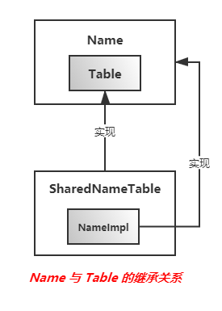

# 词法分析

> **Java源代码中的字符流转换为Token流的详细过程**

## 1. 字符编码

| 编码          | 描述                                                         |
| ------------- | ------------------------------------------------------------ |
| **ASCII**     | **美国标准信息交换码。用一个字节的7位表示，总共128个，0~31是控制字符，如换行、回车、删除等，32~126是打印字符，可以通过键盘输入并且能够显示出来** |
| **ISO8859-1** | **拉丁码表。欧洲码表用一个字节的8位表示，共能表示256个字符** |
| **GB2312**    | **中国的中文编码表。双字节编码，总范围是A1到F7，其中A1至A9是符号区，B0至F7是汉字区** |
| **GBK**       | **中文编码表升级，融合了更多的中文文字符号**                 |
| **UTF-16**    | **用两个字节表示一个字符，是定长的表示方式，任何字符都可以使用两个字节来表示** |
| **UTF-8**     | **变长编码，不同类型的字符可以由1~6个字节组成**              |

### 1.1 字符集与编码

> **`字符集(character set)`：为每个字符分配一个唯一编号，为每个字符分配的编号在Unicode字符集中称为码位(code point)。如中文字符'啊'的码位为0x554A，记为U+554A。Unicode标准始终使用十六进制数字，所以书写时在前面加上前缀"U+"。**
>
> **`编码`：指定以何种格式将码位以字节或位的方式表示出来。如中文字符'啊'的UTF-16编码表示为`0x55 0x4A(Big-endian表示)`，而UTF-8编码却表示为`0xE5 0x95 0x8A`。两种编码的目标字符集相同，但在内存中的表现形式却不同。**

### 1.2  UTF-16、UTF-8

> **UTF-16编码：**
>
> **Unicode字符集采用两个字节来编码一个字符，而UTF-16编码就是直接采用了这固定的的两个字节，内存表现方式比较简单、直接。**
>
> **但是使用两个字节表示一个字符时，内存上的表示方式会根据环境的字节序发生变化，即`Big-endian`或`Little-endian`。**
>
> **缺点：**
>
> > 1. **虽然Unicode字符集在0x00~0x7E的范围内分配了和ASCII编码相同的码位，但是如果使用UTF-16编码时，需要两个字节存储并且由于字节序的关系导致这种编码既战胜内存又不能兼容ASCII编码，所以出现了UTF-8编码**
> > 2. **两个字节编码一个字符，能表示的范围有限，不能表示所有字符，所以之后又引入了`代理对(Surrogate Pair)`来扩展表示范围，即如果字符的代码点大于等于U+10000而小于U+10FFFF时就处于增补字符中。UTF-16用两个16位来表示，并且正好将每个16位都控制在替代区域U+D800至U+DFFF（其中U+D800至U+DBFF为高代理范围， U+DC00至U+DFFF为低代理范围）中**

> **UTF-8编码：**
>
> **变长编码方式，不同类型的字符可以由1~6个字节组成。**
>
> **Unicode字符集与UTF-8编码之间的转换关系：**
>
> ```
> Unicode符号范围     |        UTF-8编码方式
> (十六进制)        |              （二进制）
> ----------------------+---------------------------------------------
> 0000 0000-0000 007F | 0xxxxxxx
> 0000 0080-0000 07FF | 110xxxxx 10xxxxxx
> 0000 0800-0000 FFFF | 1110xxxx 10xxxxxx 10xxxxxx
> 0001 0000-0010 FFFF | 11110xxx 10xxxxxx 10xxxxxx 10xxxxxx
> ```
>
> > **对于在U+00000000至U+0000007F范围内的码位与ASCII编码相同，所以这种方式兼容了ASCII编码，但这种编码对于有些字符会占用更多的字节，最多可能到6个字节。**

> **Java在生成Class文件时，字符常量会使用一种改进的UTF-8编码(modified UTF-8)， 这种改进的编码会使用上面标准的UTF-8编码中的单字节、双字节和三字节格式。因为三字节格式有效的编码位为16位，所以多于三个字节的位要使用更的字节来表示。对于UTF-16编码来说，多于16位的会使用2个16位来表示，而改进的UTF-8编码在处理超过16位表示范围的字符时，采取和UTF-16编码类似的处理方式，以代理对的形式表示。**

## 2. 获取字符输入流

> **以如下方法为例：Java源文件在Javac中被表示为`RegularFileObject`对象，将此对象作为参数调用`readSource()`方法获取字符输入流，然后将获取到的`CharSequence`对象作为参数调用`parse()`方法，这个方法会将字符输入流转换为Token流，然后将这个Token流转换为抽象语法树。**

```java
//com.sun.tools.javac.main.JavaCompiler
public JCTree.JCCompilationUnit parse(JavaFileObject filename) {
        JavaFileObject prev = log.useSource(filename);
        try {
            JCTree.JCCompilationUnit t = parse(filename, readSource(filename));
            if (t.endPositions != null)
                log.setEndPosTable(filename, t.endPositions);
            return t;
        } finally {
            log.useSource(prev);
        }
}

public CharSequence readSource(JavaFileObject filename) {
        try {
            inputFiles.add(filename);
            return filename.getCharContent(false);
        } catch (IOException e) {
            log.error("error.reading.file", filename, JavacFileManager.getMessage(e));
            return null;
        }
    }

//----- 以RegularFileObject为例, RegularFileObject#getCharContent方法
public CharBuffer getCharContent(boolean ignoreEncodingErrors) throws IOException {
        CharBuffer cb = fileManager.getCachedContent(this);
        if (cb == null) {
            InputStream in = new FileInputStream(file);
            try {
                ByteBuffer bb = fileManager.makeByteBuffer(in);
                JavaFileObject prev = fileManager.log.useSource(this);
                try {
                    cb = fileManager.decode(bb, ignoreEncodingErrors);
                } finally {
                    fileManager.log.useSource(prev);
                }
                fileManager.recycleByteBuffer(bb);
                if (!ignoreEncodingErrors) {
                    fileManager.cache(this, cb);
                }
            } finally {
                in.close();
            }
        }
        return cb;
    }
```

## 3. Token 与 Name

### 3.1 Token

> **Token对象大概分为5类：**
>
> 1. **标识符号： 运算符及分隔符等**
> 2. **保留关键字：包括Java中没用到的const和goto**
> 3. **标识符：Token.IDENTIFIER，用来泛指用户自定义的类名、包名、变量包、方法名等**
> 4. **字面量：INTLITERAL, LONGLITERAL, FLOATLITERAL, DOUBLELITERAL, CHARLITERAL, STRINGLITERAL, TRUE("true"), FALSE("false"), NULL("null")等**
> 5. **特殊类型：ERROR 和 EOF，当词法分析不能将读取到的一组字符映射为除ERROR之外的任何一种Token对象时，会将读取到下一个分隔符之间的所有字符映射为ERROR。当读取到文件的末尾时生成一个EOF，作为Token流的结束标记**

```java
public enum Token implements Formattable { //com.sun.tools.javac.parser.Token
    EOF,
    ERROR,
    IDENTIFIER,
    ABSTRACT("abstract"),
    ASSERT("assert"),
    BOOLEAN("boolean"),
    BREAK("break"),
    BYTE("byte"),
    CASE("case"),
    CATCH("catch"),
    CHAR("char"),
    CLASS("class"),
    CONST("const"),
    CONTINUE("continue"),
    DEFAULT("default"),
    DO("do"),
    DOUBLE("double"),
    ELSE("else"),
    ENUM("enum"),
    EXTENDS("extends"),
    FINAL("final"),
    FINALLY("finally"),
    FLOAT("float"),
    FOR("for"),
    GOTO("goto"),
    IF("if"),
    IMPLEMENTS("implements"),
    IMPORT("import"),
    INSTANCEOF("instanceof"),
    INT("int"),
    INTERFACE("interface"),
    LONG("long"),
    NATIVE("native"),
    NEW("new"),
    PACKAGE("package"),
    PRIVATE("private"),
    PROTECTED("protected"),
    PUBLIC("public"),
    RETURN("return"),
    SHORT("short"),
    STATIC("static"),
    STRICTFP("strictfp"),
    SUPER("super"),
    SWITCH("switch"),
    SYNCHRONIZED("synchronized"),
    THIS("this"),
    THROW("throw"),
    THROWS("throws"),
    TRANSIENT("transient"),
    TRY("try"),
    VOID("void"),
    VOLATILE("volatile"),
    WHILE("while"),
    INTLITERAL,
    LONGLITERAL,
    FLOATLITERAL,
    DOUBLELITERAL,
    CHARLITERAL,
    STRINGLITERAL,
    TRUE("true"),
    FALSE("false"),
    NULL("null"),
    LPAREN("("),
    RPAREN(")"),
    LBRACE("{"),
    RBRACE("}"),
    LBRACKET("["),
    RBRACKET("]"),
    SEMI(";"),
    COMMA(","),
    DOT("."),
    ELLIPSIS("..."),
    EQ("="),
    GT(">"),
    LT("<"),
    BANG("!"),
    TILDE("~"),
    QUES("?"),
    COLON(":"),
    EQEQ("=="),
    LTEQ("<="),
    GTEQ(">="),
    BANGEQ("!="),
    AMPAMP("&&"),
    BARBAR("||"),
    PLUSPLUS("++"),
    SUBSUB("--"),
    PLUS("+"),
    SUB("-"),
    STAR("*"),
    SLASH("/"),
    AMP("&"),
    BAR("|"),
    CARET("^"),
    PERCENT("%"),
    LTLT("<<"),
    GTGT(">>"),
    GTGTGT(">>>"),
    PLUSEQ("+="),
    SUBEQ("-="),
    STAREQ("*="),
    SLASHEQ("/="),
    AMPEQ("&="),
    BAREQ("|="),
    CARETEQ("^="),
    PERCENTEQ("%="),
    LTLTEQ("<<="),
    GTGTEQ(">>="),
    GTGTGTEQ(">>>="),
    MONKEYS_AT("@"),
    CUSTOM;

    Token() {
        this(null);
    }
    Token(String name) {
        this.name = name;
    }

    public final String name;

    public String toString() {
        switch (this) {
        case IDENTIFIER:
            return "token.identifier";
        case CHARLITERAL:
            return "token.character";
        case STRINGLITERAL:
            return "token.string";
        case INTLITERAL:
            return "token.integer";
        case LONGLITERAL:
            return "token.long-integer";
        case FLOATLITERAL:
            return "token.float";
        case DOUBLELITERAL:
            return "token.double";
        case ERROR:
            return "token.bad-symbol";
        case EOF:
            return "token.end-of-input";
        case DOT: case COMMA: case SEMI: case LPAREN: case RPAREN:
        case LBRACKET: case RBRACKET: case LBRACE: case RBRACE:
            return "'" + name + "'";
        default:
            return name;
        }
    }

    public String getKind() {
        return "Token";
    }

    public String toString(Locale locale, Messages messages) {
        return name != null ? toString() : messages.getLocalizedString(locale, "compiler.misc." + toString());
    }
}
```

### 3.2  Name对象的生成与存储

> ***Javac会将Java源代码中用到的字符串封装为`com.sun.tools.javac.util.Name`对象，例如Java中的标识符号、保留关键字等，并且`相同的字符串用同一个Name对象表示`，这样在判断Name对象是否相等时就可以直接通过恒等去处符"=="来判断了***
>
> **多个Name对象通过Table类中的数组来存储， Name与 Table相关类的继承关系如下 ：**
>
> 
>
> **Name类的实现类为NameImpl，定义在SharedNameTable类中，而Table类定义在Name类中，主要的实现类为SharedNameTable**

> **在Token类中定义的所有Toke对象中，除去没有name的Token对象，每个Token对象的name都可以用一个NameImpl对象来表示，所以的NameImpl对象全部存储到了ShareNameTable类的hashes数组中。**

> **NameImpl 和 SharedNameTable 结构逻辑：**
>
> **`NameImpl`标识一个字符串，但这个字符串没有直接定义为类内部的成员变量，而是定义了`字节数组索引`以及`长度`。**
>
> **NameImpl的`字节数组索引`和`长度`指向的是一个特定的`SharedNameTable`中定义的字节数组`bytes`，`字节数组bytes`是统一的保存所有字符串的字节数组信息，由`NameImpl`的相关成员变量指示。`所以NameImpl需要持有一个Table引用，因为需要用它来确定bytes字节数组`**
>
> **而为了节省空间，防止在字节数组中保存多个重复字符串的字节数组，所以在`SharedNameTable中定义了NameImpl[] hashes成员变量`， 它的作用是去复。即在`SharedNameTable`在使用将byte[]数组信息加入到`bytes`之前，会调用`hashValue()方法`先计算byte[]数组的一个值，并用它计算对应的hashes索引。如果在hashes对应索引上为null，则表示`bytes数组中没有保存过相应信息`，再构造NameImpl实例。而如果hashes对应索引上非null，再依次判断链表中是否已保存过相应信息。**
>
> **所以`hashes`是为了在不遍历整个bytes数组的情况下达到去重的目的。**

```java
// --- Name.java
public abstract class Name implements javax.lang.model.element.Name {
    public final Table table; //持有Table实例

    protected Name(Table table) { this.table = table; }

    public boolean contentEquals(CharSequence cs) {
        return toString().equals(cs.toString());
    }

    //字符串长度
    public int length() { return toString().length();}

    public char charAt(int index) { return toString().charAt(index);}

    public CharSequence subSequence(int start, int end) {
        return toString().subSequence(start, end);
    }

    public Name append(Name n) {
        int len = getByteLength();
        byte[] bs = new byte[len + n.getByteLength()];
        getBytes(bs, 0);
        n.getBytes(bs, len);
        return table.fromUtf(bs, 0, bs.length);
    }

    public Name append(char c, Name n) {
        int len = getByteLength();
        byte[] bs = new byte[len + 1 + n.getByteLength()];
        getBytes(bs, 0);
        bs[len] = (byte) c;
        n.getBytes(bs, len+1);
        return table.fromUtf(bs, 0, bs.length);
    }

    public int compareTo(Name other) {
        return other.getIndex() - this.getIndex();
    }
    
    public boolean isEmpty() { return getByteLength() == 0; }

    public int lastIndexOf(byte b) {
        byte[] bytes = getByteArray();
        int offset = getByteOffset();
        int i = getByteLength() - 1;
        while (i >= 0 && bytes[offset + i] != b) i--;
        return i;
    }

    public boolean startsWith(Name prefix) {
        byte[] thisBytes = this.getByteArray();
        int thisOffset   = this.getByteOffset();
        int thisLength   = this.getByteLength();
        byte[] prefixBytes = prefix.getByteArray();
        int prefixOffset   = prefix.getByteOffset();
        int prefixLength   = prefix.getByteLength();

        int i = 0;
        while (i < prefixLength &&
               i < thisLength &&
               thisBytes[thisOffset + i] == prefixBytes[prefixOffset + i])
            i++;
        return i == prefixLength;
    }

    public Name subName(int start, int end) {
        if (end < start) end = start;
        return table.fromUtf(getByteArray(), getByteOffset() + start, end - start);
    }

    public String toString() { //byte[]转String
        return Convert.utf2string(getByteArray(), getByteOffset(), getByteLength());
    }

    public byte[] toUtf() { //获取本Name对应的byte[]数组
        byte[] bs = new byte[getByteLength()];
        getBytes(bs, 0);
        return bs;
    }
    
    //复制本Name对应的byte[]内容到 cs[start] 处
    public void getBytes(byte cs[], int start) {
        System.arraycopy(getByteArray(), getByteOffset(), cs, start, getByteLength());
    }
    //--- 抽象方法
    public abstract int getIndex();
    public abstract int getByteLength();
    public abstract byte getByteAt(int i);
    public abstract byte[] getByteArray();
    public abstract int getByteOffset();
	//... Name.Table内部类
}

//--- SharedNameTable.NameImpl内部类
//NameImpl并不直接存储name字符串, 字符串在SharedNameTable.bytes[]数组中
//本实例只是持有name字符串在bytes[]数组中的索引index以及长度length
static class NameImpl extends Name {
        NameImpl next; //用于存储到SharedNameTable.hashes数组中解决哈希冲突问题

        //name字符串在SharedNameTable#bytes数组的索引
        int index; 

        int length; //name字符串对应的字节数组长度

        NameImpl(SharedNameTable table) { super(table);}

        @Override public int getIndex() { return index; }

        @Override public int getByteLength() {
            return length;
        }

        @Override public byte getByteAt(int i) {
            return getByteArray()[index + i];
        }

        //获取整个 SharedNameTable.bytes[]数组	
        @Override public byte[] getByteArray() { 
            return ((SharedNameTable) table).bytes;
        }

        @Override public int getByteOffset() { return index;}

        //---重写的hashCode和equals方法
        public int hashCode() { return index; }

        public boolean equals(Object other) {
            if (other instanceof Name)
                return table == ((Name)other).table && index == ((Name) other).getIndex();
            else return false;
        }
}
```


```java
//--- Name.Table内部类
public static abstract class Table {
        public final Names names; //Table持有Names实例

        Table(Names names) {
            this.names = names;
        }
    
	    //从char[] 或 String中获取Name
        public abstract Name fromChars(char[] cs, int start, int len);

        public Name fromString(String s) {
            char[] cs = s.toCharArray();
            return fromChars(cs, 0, cs.length);
        }

       	// 从byte[]中获取Name
        public Name fromUtf(byte[] cs) {
            return fromUtf(cs, 0, cs.length);
        }
    
        public abstract Name fromUtf(byte[] cs, int start, int len);

        public abstract void dispose();

        protected static int hashValue(byte bytes[], int offset, int length) {
            int h = 0;
            int off = offset;

            for (int i = 0; i < length; i++) {
                h = (h << 5) - h + bytes[off++];
            }
            return h;
        }
}

//--- SharedNameTable.java 
public class SharedNameTable extends Name.Table {
    private NameImpl[] hashes; //通过计算NameImpl对象的哈希值将其存储到hashes数组的特定位置, 出现冲突时使用NameImple.next组成链表
 	public byte[] bytes;  //统一存储所有的NameImpl对象中需要存储的多个字符(涉及到字节到字符的转换)
    
    private int hashMask; //hash mask值
    private int nc = 0; //The number of filled bytes in 'names'
    
    //hashSize: hashes数组长度; nameSize: bytes数组长度
    public SharedNameTable(Names names, int hashSize, int nameSize) {
        super(names);
        hashMask = hashSize - 1;
        hashes = new NameImpl[hashSize];
        bytes = new byte[nameSize];
    }
    //默认hashes数组长度0x8000; 默认bytes数组长度0x20000
    public SharedNameTable(Names names) {
        this(names, 0x8000, 0x20000); 
    }
    
    //从char[]构建Name实例
    @Override public Name fromChars(char[] cs, int start, int len) {
        int nc = this.nc; //nc表示bytes[]中已写入的字节数, 也表示要往bytes[]写入新数据时的起始索引
        byte[] bytes = this.bytes;
        //如果bytes[]长度不够, 则将bytes[]长度翻倍扩容
        while (nc + len * 3 >= bytes.length) {
            byte[] newnames = new byte[bytes.length * 2];
            System.arraycopy(bytes, 0, newnames, 0, bytes.length);
            bytes = this.bytes = newnames;
        }
        
        //Convert.chars2utf将cs[]中的数据转换成byte[]后写入到bytes[]从nc开始空间后
        //Convert.chars2utf的返回值是bytes[]写入数据后的下一个可写入索引值;
        //所以nbytes表示 cs[]转换成byte[]后的字节长度
        int nbytes = Convert.chars2utf(cs, start, bytes, nc, len) - nc;
        int h = hashValue(bytes, nc, nbytes) & hashMask; //计算byte[] hash value以及在hashes数组中的索引
        
        //测试在hases[h]处是否已经保存过同样的字符串, 如果有, 则n最终不为null
        NameImpl n = hashes[h]; 
        while (n != null &&
                (n.getByteLength() != nbytes ||
                !equals(bytes, n.index, bytes, nc, nbytes))) {
            n = n.next;
        }
        //n为null表示bytes中没有保存过char[] cs对应的字符串
        if (n == null) {
            n = new NameImpl(this); //创建NameImpl实例
            n.index = nc;
            n.length = nbytes;
            n.next = hashes[h]; //将NameImpl放到hashes[i]链表头
            hashes[h] = n;
            this.nc = nc + nbytes; //更新this.nc
            if (nbytes == 0) {
                this.nc++;
            }
        }
        return n;
    }
    
    //从bye[]构建Name实例
    @Override public Name fromUtf(byte[] cs, int start, int len) {
        int h = hashValue(cs, start, len) & hashMask;
        NameImpl n = hashes[h];
        byte[] names = this.bytes;
        while (n != null &&
                (n.getByteLength() != len || !equals(names, n.index, cs, start, len))) {
            n = n.next;
        }
        if (n == null) {
            int nc = this.nc;
            while (nc + len > names.length) {
                byte[] newnames = new byte[names.length * 2];
                System.arraycopy(names, 0, newnames, 0, names.length);
                names = this.bytes = newnames;
            }
            System.arraycopy(cs, start, names, nc, len);
            n = new NameImpl(this);
            n.index = nc;
            n.length = len;
            n.next = hashes[h];
            hashes[h] = n;
            this.nc = nc + len;
            if (len == 0) {
                this.nc++;
            }
        }
        return n;
    }
}
```

### 3.3 Name映射为Token

> **通过3.2的`StandardNameTable#fromChars()/fromUtf()`方法，Javac可以用Name对象来表示特定的字符数组或字符串了，然后通过Name对象查找具体的Token对象。完成Name对象到Token对象映射的类是`com.sun.tools.javac.parser.Keywords`**

```java
public class Keywords { //com.sun.tools.javac.parser.Keywords
    private final Names names;
    
    //NameImpl对象到Token对象的映射; 
    //这个数组的下标为 Name.getIndex() 值
    private final Token[] key; //Keyword array

    private int maxKey = 0; //在names.table中最后一个Name实例对应的index值

    //Token对象到Name对象的映射
    private Name[] tokenName = new Name[Token.values().length];

    private void enterKeyword(String s, Token token) {
        Name n = names.fromString(s);
        tokenName[token.ordinal()] = n;
        if (n.getIndex() > maxKey) maxKey = n.getIndex();
    }

    protected Keywords(Context context) {
        context.put(keywordsKey, this);
        names = Names.instance(context); //获取Names实例

        //用Token.name构建Name实例并放入tokeName的对应索引处
        /*tokenName最终结果示例：
        t[0] = null; //EOF
        t[1] = null; //ERROR
        t[2] = null; //IDENTIFIER
        t[3] = NameImple("abstract"); //Abstract("abstract")
        ...
        t[109] = NameImpl("@"); //MONKEYS_AT("@")
        t[110] = null; //CUSTOM
        */
        for (Token t : Token.values()) {
            if (t.name != null)
                enterKeyword(t.name, t);
            else
                tokenName[t.ordinal()] = null;
        }

        //创建Name到Token的映射;  这里下标为Name.getIndex
        //由于Name.getIndex的值并不连续, 所以先将所有值初始为IDENTIFIER;
        //再更新每个不同的Name所对应的getIndex处的值
        key = new Token[maxKey+1];
        for (int i = 0; i <= maxKey; i++) key[i] = IDENTIFIER;
        for (Token t : Token.values()) {
            if (t.name != null)
                key[tokenName[t.ordinal()].getIndex()] = t;
        }
    }
```

#### 3.3.1 Names类

> **初始化SharedNameTable实例，并创建了一堆字符串对应的Name实例**

```java
public class Names {
    public static final Context.Key<Names> namesKey = new Context.Key<Names>();

    public static Names instance(Context context) {
        Names instance = context.get(namesKey);
        if (instance == null) {
            instance = new Names(context);
            context.put(namesKey, instance);
        }
        return instance;
    }

    public final Name slash;
    public final Name hyphen;
    public final Name T;
    //.. 剩下的还有一堆类似的成员变量, 参考下面的构造方法
    
    public final Name.Table table;

    public Names(Context context) {
        Options options = Options.instance(context);
        
        //这里创建了SharedNameTable实例
        table = createTable(options); 

        //这里调用table的相关方法初始化对应的Name类型成员变量
        slash = fromString("/");
        hyphen = fromString("-");
        T = fromString("T");
        slashequals = fromString("/=");
        deprecated = fromString("deprecated");

        init = fromString("<init>");
        clinit = fromString("<clinit>");
        error = fromString("<error>");
        any = fromString("<any>");
        empty = fromString("");
        one = fromString("1");
        period = fromString(".");
        comma = fromString(",");
        semicolon = fromString(";");
        asterisk = fromString("*");
        _this = fromString("this");
        _super = fromString("super");
        _default = fromString("default");

        _class = fromString("class");
        java_lang = fromString("java.lang");
        java_lang_Object = fromString("java.lang.Object");
        java_lang_Class = fromString("java.lang.Class");
        java_lang_Cloneable = fromString("java.lang.Cloneable");
        java_io_Serializable = fromString("java.io.Serializable");
        java_lang_Enum = fromString("java.lang.Enum");
        java_lang_invoke_MethodHandle = fromString("java.lang.invoke.MethodHandle");
        package_info = fromString("package-info");
        serialVersionUID = fromString("serialVersionUID");
        ConstantValue = fromString("ConstantValue");
        LineNumberTable = fromString("LineNumberTable");
        LocalVariableTable = fromString("LocalVariableTable");
        LocalVariableTypeTable = fromString("LocalVariableTypeTable");
        CharacterRangeTable = fromString("CharacterRangeTable");
        StackMap = fromString("StackMap");
        StackMapTable = fromString("StackMapTable");
        SourceID = fromString("SourceID");
        CompilationID = fromString("CompilationID");
        Code = fromString("Code");
        Exceptions = fromString("Exceptions");
        SourceFile = fromString("SourceFile");
        InnerClasses = fromString("InnerClasses");
        Synthetic = fromString("Synthetic");
        Bridge = fromString("Bridge");
        Deprecated = fromString("Deprecated");
        Enum = fromString("Enum");
        _name = fromString("name");
        Signature = fromString("Signature");
        Varargs = fromString("Varargs");
        Annotation = fromString("Annotation");
        RuntimeVisibleAnnotations = fromString("RuntimeVisibleAnnotations");
        RuntimeInvisibleAnnotations = fromString("RuntimeInvisibleAnnotations");
        RuntimeVisibleTypeAnnotations = fromString("RuntimeVisibleTypeAnnotations");
        RuntimeInvisibleTypeAnnotations = fromString("RuntimeInvisibleTypeAnnotations");
        RuntimeVisibleParameterAnnotations = fromString("RuntimeVisibleParameterAnnotations");
        RuntimeInvisibleParameterAnnotations = fromString("RuntimeInvisibleParameterAnnotations");
        Value = fromString("Value");
        EnclosingMethod = fromString("EnclosingMethod");

        desiredAssertionStatus = fromString("desiredAssertionStatus");

        append = fromString("append");
        family = fromString("family");
        forName = fromString("forName");
        toString = fromString("toString");
        length = fromString("length");
        valueOf = fromString("valueOf");
        value = fromString("value");
        getMessage = fromString("getMessage");
        getClass = fromString("getClass");

        TYPE = fromString("TYPE");
        TYPE_USE = fromString("TYPE_USE");
        TYPE_PARAMETER = fromString("TYPE_PARAMETER");
        FIELD = fromString("FIELD");
        METHOD = fromString("METHOD");
        PARAMETER = fromString("PARAMETER");
        CONSTRUCTOR = fromString("CONSTRUCTOR");
        LOCAL_VARIABLE = fromString("LOCAL_VARIABLE");
        ANNOTATION_TYPE = fromString("ANNOTATION_TYPE");
        PACKAGE = fromString("PACKAGE");

        SOURCE = fromString("SOURCE");
        CLASS = fromString("CLASS");
        RUNTIME = fromString("RUNTIME");

        Array = fromString("Array");
        Method = fromString("Method");
        Bound = fromString("Bound");
        clone = fromString("clone");
        getComponentType = fromString("getComponentType");
        getClassLoader = fromString("getClassLoader");
        initCause = fromString("initCause");
        values = fromString("values");
        iterator = fromString("iterator");
        hasNext = fromString("hasNext");
        next = fromString("next");
        AnnotationDefault = fromString("AnnotationDefault");
        ordinal = fromString("ordinal");
        equals = fromString("equals");
        hashCode = fromString("hashCode");
        compareTo = fromString("compareTo");
        getDeclaringClass = fromString("getDeclaringClass");
        ex = fromString("ex");
        finalize = fromString("finalize");

        java_lang_AutoCloseable = fromString("java.lang.AutoCloseable");
        close = fromString("close");
        addSuppressed = fromString("addSuppressed");
    }
	//其它方法...略
}
```

## 4. 生成Token流

> **参考第2节，将文件读取到CharBuffer对象中后会调用重载国的parse()方法：**
>
> **parse() 方法通过content获取到了Parser对象parser，然后又调用了parser.parseCompilationUnit() 方法，这个方法会根据content创建一棵抽象语法树。Javac并没有先将字符流完全转换成Token流，然后再在Token流的基础上组建抽象语法树，而是每读取一部分Token对象后就按照JLS 中的方法生成抽象语法树节点，也就是说加读取Token对象边组建抽象语法树。**
>
> **每调用一次 Scanner 类中的 nextToken() 方法，就可以获取下一个 Token 对象。调用nextToken() 方法首先需要通过工厂类 ScannerFactory 获取 Scanner 对象，在ParserFactory类的newParser()方法中有相关方法调用。**

```java
/**  com.sun.tools.javac.main.JavaCompiler
  *  Parse contents of input stream.
  *  @param filename     The name of the file from which input stream comes.
  *  @param input        The input stream to be parsed.
   */
protected JCCompilationUnit parse(JavaFileObject filename, CharSequence content) {
   		long msec = now();
        JCCompilationUnit tree = make.TopLevel(List.<JCTree.JCAnnotation>nil(),
                                      null, List.<JCTree>nil());
        if (content != null) {
            if (taskListener != null) {
                TaskEvent e = new TaskEvent(TaskEvent.Kind.PARSE, filename);
                taskListener.started(e);
            }
            /* parserFactory.newParser() 方法如下:
            //input就是content参数; 
            Lexer lexer = scannerFactory.newScanner(input, keepDocComments);
        	if (keepEndPos) {
            	return new EndPosParser(this, lexer, keepDocComments, keepLineMap);
        	} else {
            	return new JavacParser(this, lexer, keepDocComments, keepLineMap);
        	}
            */
            Parser parser = parserFactory.newParser(content, keepComments(), genEndPos, lineDebugInfo);
            tree = parser.parseCompilationUnit();
        }

        tree.sourcefile = filename;

        if (content != null && taskListener != null) {
            TaskEvent e = new TaskEvent(TaskEvent.Kind.PARSE, tree);
            taskListener.finished(e);
        }

        return tree;
}
```

### 4.1  获取Scanner

> **`parserFactory.newParser()` 中 `scannerFactory.newScanner(input, keepDocComments)` 一行的逻辑**

```java
// com.sun.tools.javac.parser.ScannerFactory
public Scanner newScanner(CharSequence input, boolean keepDocComments) { 
        if (input instanceof CharBuffer) {
            CharBuffer buf = (CharBuffer) input;
            if (keepDocComments)
                return new DocCommentScanner(this, buf);
            else
                return new Scanner(this, buf); //一般会执行到这儿来创建Scanner实例
        } else {
            char[] array = input.toString().toCharArray();
            return newScanner(array, array.length, keepDocComments);
        }
}

// com.sun.tools.javac.parser.Scanner
protected Scanner(ScannerFactory fac, CharBuffer buffer) {
        this(fac, JavacFileManager.toArray(buffer), buffer.limit()); //调用重载的构造方法
}

protected Scanner(ScannerFactory fac, char[] input, int inputLength) {
        this(fac);
        eofPos = inputLength; //初始化eofPos为字符数组长度
        if (inputLength == input.length) {
            if (input.length > 0 && Character.isWhitespace(input[input.length - 1])) {
                inputLength--;
            } else {
                char[] newInput = new char[inputLength + 1];
                System.arraycopy(input, 0, newInput, 0, input.length);
                input = newInput;
            }
        }
        buf = input; //赋值buf成员变量
        buflen = inputLength; //赋值buf长度
        //0x1A; 哨兵字符, 标识读取到末尾
        buf[buflen] = EOI;
        bp = -1; //已读取到字节数组的索引
        scanChar(); //读取第一个字符, 并赋值给成员变量 ch
}

private void scanChar() {
        ch = buf[++bp];
    	//对于需要转换Unicode的情况, 暂略, 假设java代码中全是英文
        if (ch == '\\') { convertUnicode(); }
}

//-- Scanner.nextToken方法
public void nextToken() {
        try {
            prevEndPos = endPos; //暂存原endPos成员变量值
            sp = 0; //初始化sp
            while (true) {
                pos = bp; //暂存当前已读取到的位置
                switch (ch) {
                case ' ': // (Spec 3.6)
                case '\t': // (Spec 3.6)
                case FF: // (Spec 3.6)
                    do {
                        scanChar();
                    } while (ch == ' ' || ch == '\t' || ch == FF);
                    endPos = bp;
                    processWhiteSpace();
                    break;
                case LF: // (Spec 3.4)
                    scanChar();
                    endPos = bp;
                    processLineTerminator();
                    break;
                case CR: // (Spec 3.4)
                    scanChar();
                    if (ch == LF) {
                        scanChar();
                    }
                    endPos = bp;
                    processLineTerminator();
                    break;
                case 'A': case 'B': case 'C': case 'D': case 'E':
                case 'F': case 'G': case 'H': case 'I': case 'J':
                case 'K': case 'L': case 'M': case 'N': case 'O':
                case 'P': case 'Q': case 'R': case 'S': case 'T':
                case 'U': case 'V': case 'W': case 'X': case 'Y':
                case 'Z':
                case 'a': case 'b': case 'c': case 'd': case 'e':
                case 'f': case 'g': case 'h': case 'i': case 'j':
                case 'k': case 'l': case 'm': case 'n': case 'o':
                case 'p': case 'q': case 'r': case 's': case 't':
                case 'u': case 'v': case 'w': case 'x': case 'y':
                case 'z':
                case '$': case '_':
                    scanIdent();
                    return;
                case '0':
                    scanChar();
                    if (ch == 'x' || ch == 'X') {
                        scanChar();
                        skipIllegalUnderscores();
                        if (ch == '.') {
                            scanHexFractionAndSuffix(false);
                        } else if (digit(16) < 0) {
                            lexError("invalid.hex.number");
                        } else {
                            scanNumber(16);
                        }
                    } else if (ch == 'b' || ch == 'B') {
                        if (!allowBinaryLiterals) {
                            lexError("unsupported.binary.lit", source.name);
                            allowBinaryLiterals = true;
                        }
                        scanChar();
                        skipIllegalUnderscores();
                        if (digit(2) < 0) {
                            lexError("invalid.binary.number");
                        } else {
                            scanNumber(2);
                        }
                    } else {
                        putChar('0');
                        if (ch == '_') {
                            int savePos = bp;
                            do {
                                scanChar();
                            } while (ch == '_');
                            if (digit(10) < 0) {
                                lexError(savePos, "illegal.underscore");
                            }
                        }
                        scanNumber(8);
                    }
                    return;
                case '1': case '2': case '3': case '4':
                case '5': case '6': case '7': case '8': case '9':
                    scanNumber(10);
                    return;
                case '.':
                    scanChar();
                    if ('0' <= ch && ch <= '9') {
                        putChar('.');
                        scanFractionAndSuffix();
                    } else if (ch == '.') {
                        putChar('.'); putChar('.');
                        scanChar();
                        if (ch == '.') {
                            scanChar();
                            putChar('.');
                            token = ELLIPSIS;
                        } else {
                            lexError("malformed.fp.lit");
                        }
                    } else {
                        token = DOT;
                    }
                    return;
                case ',':
                    scanChar(); token = COMMA; return;
                case ';':
                    scanChar(); token = SEMI; return;
                case '(':
                    scanChar(); token = LPAREN; return;
                case ')':
                    scanChar(); token = RPAREN; return;
                case '[':
                    scanChar(); token = LBRACKET; return;
                case ']':
                    scanChar(); token = RBRACKET; return;
                case '{':
                    scanChar(); token = LBRACE; return;
                case '}':
                    scanChar(); token = RBRACE; return;
                case '/':
                    scanChar();
                    if (ch == '/') {
                        do {
                            scanCommentChar();
                        } while (ch != CR && ch != LF && bp < buflen);
                        if (bp < buflen) {
                            endPos = bp;
                            processComment(CommentStyle.LINE);
                        }
                        break;
                    } else if (ch == '*') {
                        scanChar();
                        CommentStyle style;
                        if (ch == '*') {
                            style = CommentStyle.JAVADOC;
                            scanDocComment();
                        } else {
                            style = CommentStyle.BLOCK;
                            while (bp < buflen) {
                                if (ch == '*') {
                                    scanChar();
                                    if (ch == '/') break;
                                } else {
                                    scanCommentChar();
                                }
                            }
                        }
                        if (ch == '/') {
                            scanChar();
                            endPos = bp;
                            processComment(style);
                            break;
                        } else {
                            lexError("unclosed.comment");
                            return;
                        }
                    } else if (ch == '=') {
                        name = names.slashequals;
                        token = SLASHEQ;
                        scanChar();
                    } else {
                        name = names.slash;
                        token = SLASH;
                    }
                    return;
                case '\'':
                    scanChar();
                    if (ch == '\'') {
                        lexError("empty.char.lit");
                    } else {
                        if (ch == CR || ch == LF)
                            lexError(pos, "illegal.line.end.in.char.lit");
                        scanLitChar();
                        if (ch == '\'') {
                            scanChar();
                            token = CHARLITERAL;
                        } else {
                            lexError(pos, "unclosed.char.lit");
                        }
                    }
                    return;
                case '\"':
                    scanChar();
                    while (ch != '\"' && ch != CR && ch != LF && bp < buflen)
                        scanLitChar();
                    if (ch == '\"') {
                        token = STRINGLITERAL;
                        scanChar();
                    } else {
                        lexError(pos, "unclosed.str.lit");
                    }
                    return;
                default:
                    if (isSpecial(ch)) {
                        scanOperator();
                    } else {
                        boolean isJavaIdentifierStart;
                        if (ch < '\u0080') {
                            // all ASCII range chars already handled, above
                            isJavaIdentifierStart = false;
                        } else {
                            char high = scanSurrogates();
                            if (high != 0) {
                                if (sp == sbuf.length) {
                                    putChar(high);
                                } else {
                                    sbuf[sp++] = high;
                                }

                                isJavaIdentifierStart = Character.isJavaIdentifierStart(
                                    Character.toCodePoint(high, ch));
                            } else {
                                isJavaIdentifierStart = Character.isJavaIdentifierStart(ch);
                            }
                        }
                        if (isJavaIdentifierStart) {
                            scanIdent();
                        } else if (bp == buflen || ch == EOI && bp+1 == buflen) { // JLS 3.5
                            token = EOF;
                            pos = bp = eofPos;
                        } else {
                            lexError("illegal.char", String.valueOf((int)ch));
                            scanChar();
                        }
                    }
                    return;
                }
            }
        } finally {
            endPos = bp;
            if (scannerDebug)
                System.out.println("nextToken(" + pos
                                   + "," + endPos + ")=|" +
                                   new String(getRawCharacters(pos, endPos))
                                   + "|");
        }
}
```

