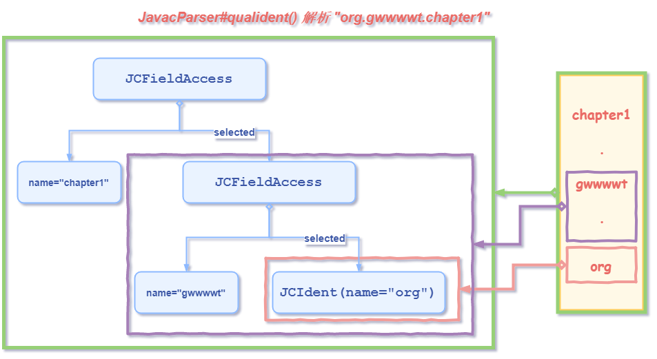

# 语法分析-建立抽象语法树

> **目的：将源文件中的符号转换成Token后，如何根据Token序列分析出具体的树节点，并最终形成一棵抽象语法树。**

> **从Token序列建立语法树的不同方式：`自顶向下分析`和`自底向上分析`。**
>
> **Javac在具体的实现过程中，主要使用了`自顶向下的LL(1)分析法`，而`自底向上则采用了算符优先分析法`。**

> **采用`LL(1)分析法`时，Javac的语法分析程序将从左向右顺序获取Token序列，每次只获取一个Token对象，然后产生一个句子的 推导。**
>
> **`LL(1)分析法`中的`第一个L表示从左到右处理输入的Token对象`，`第二个L表示会产生一个最左推导`，`括号中的"1"球每次只读取一个Token对象即可`**

> **涉及的主要实现类：`com.sun.tools.javac.parser.JavacParser`**

> **实在有点烦呀....没看完**

## 1. TreeMaker相关方法

```java
public class TreeMaker implements JCTree.Factory {
    public int pos = Position.NOPOS; //表示当前tree节点对应的在源文件字节数组中的偏移, 对应Scanner.pos
    public JCCompilationUnit toplevel; //顶层Tree节点引用

    Names names; //当前Names实例
    Types types; //Types工具类实例
    Symtab syms; //符号表

    protected TreeMaker(Context context) {
        context.put(treeMakerKey, this);
        this.pos = Position.NOPOS;
        this.toplevel = null;
        this.names = Names.instance(context);
        this.syms = Symtab.instance(context);
        this.types = Types.instance(context);
    }
    
    public TreeMaker at(int pos) { //设置当前节点pos值
        this.pos = pos;
        return this;
    }
    
    //创建JCImport节点实例
    public JCImport Import(JCTree qualid, boolean importStatic) {
        JCImport tree = new JCImport(qualid, importStatic);
        tree.pos = pos;
        return tree;
    }
    
    public JCClassDecl ClassDef(JCModifiers mods,
                                Name name,
                                List<JCTypeParameter> typarams,
                                JCExpression extending,
                                List<JCExpression> implementing,
                                List<JCTree> defs){
        JCClassDecl tree = new JCClassDecl(mods,
                                     name,
                                     typarams,
                                     extending,
                                     implementing,
                                     defs,
                                     null);
        tree.pos = pos;
        return tree;
    }
    //....其它方法逻辑类似
}
```

## 2. 定义及声明的抽象语法树

### 2. 1 工具方法

> ```java
> // com.sun.tools.javac.parser.JavacParser
> // 涉及到的重要成员变量
> private Lexer S; //成员变量, Scanner实例
> protected TreeMaker F; //创建JCTree及其子类实例的工具类
> ```

> ```java
> //Qualident = Ident { DOT Ident }
> //获取完整的标识符, 如"package org.gwwwwt.chapter", 本方法获取其中的"org.gwwwwt.chapter"字符串
> //由于在Scanner.nextToken()方法中将'org.gwwwwt.chapter'
> //分为 IDENTIFIER(org),DOT(.),IDENTIFIER(gwwwwt),DOT(.),IDENTIFER(chapter) 五个Token读取
> //所以下面代码中有对DOT的判断以及递归
> public JCExpression qualident() { 
>         //iden()实现默认返回 S.name(), 即当前字符串并调用nextToken()
>         JCExpression t = toP(F.at(S.pos()).Ident(ident()));
>         while (S.token() == DOT) { //判断下一个字符是否是'.', 如果是则继续处理后面的字符串
>             int pos = S.pos();
>             S.nextToken();
>             //需要注意此时pos为'.'的索引值, 创建的JCExpression则使用前一个字符串构建的JCExpression构建
>             //这里Select()构建的是JCFieldAccess实例, 看样子这种标识符也按成员变量访问的形式表示了
>             t = toP(F.at(pos).Select(t, ident()));
>         }
>         return t;
> }
> ```
>
> > **结果解析**
> >
> > > ***注: 包名'org.gwwwwt.chapter1'结果是`JCFieldAccess`实例，看来是将这种包名和成员变量访问都用`JCFieldAccess`表示。***
> >
> > 

> ```java
> //相关成员变量
> int mode = 0; //保存解析当前项时的期望 
> int lastmode = 0; //保存上一次被解析的项的期望
> /* mode 和 lastmode 的可能取值
>     static final int EXPR = 0x1; // 表达式
>     static final int TYPE = 0x2; // 类型
>     static final int NOPARAMS = 0x4; //允许类型不传递实际类型参数
>     static final int TYPEARG = 0x8; //类型传递了实际类型参数
>     static final int DIAMOND = 0x10; //辅助解释钻石语法
> */
> 
> //--- 表达式解析
> //--- 1. 基本表达式在term3()方法中完成解析, 另外term3()还会解析一元表达式
> /** Expression3    = PrefixOp Expression3
>      *                 | "(" Expr | TypeNoParams ")" Expression3
>      *                 | Primary {Selector} {PostfixOp}
>      *  Primary        = "(" Expression ")"
>      *                 | Literal
>      *                 | [TypeArguments] THIS [Arguments]
>      *                 | [TypeArguments] SUPER SuperSuffix
>      *                 | NEW [TypeArguments] Creator
>      *                 | Ident { "." Ident }
>      *                   [ "[" ( "]" BracketsOpt "." CLASS | Expression "]" )
>      *                   | Arguments
>      *                   | "." ( CLASS | THIS | [TypeArguments] SUPER Arguments | NEW [TypeArguments] InnerCreator )
>      *                   ]
>      *                 | BasicType BracketsOpt "." CLASS
>      *  PrefixOp       = "++" | "--" | "!" | "~" | "+" | "-"
>      *  PostfixOp      = "++" | "--"
>      *  Type3          = Ident { "." Ident } [TypeArguments] {TypeSelector} BracketsOpt
>      *                 | BasicType
>      *  TypeNoParams3  = Ident { "." Ident } BracketsOpt
>      *  Selector       = "." [TypeArguments] Ident [Arguments]
>      *                 | "." THIS
>      *                 | "." [TypeArguments] SUPER SuperSuffix
>      *                 | "." NEW [TypeArguments] InnerCreator
>      *                 | "[" Expression "]"
>      *  TypeSelector   = "." Ident [TypeArguments]
>      *  SuperSuffix    = Arguments | "." Ident [Arguments]
>      */
> protected JCExpression term3() {
>         int pos = S.pos();
>         JCExpression t;
>         List<JCExpression> typeArgs = typeArgumentsOpt(EXPR);
>         switch (S.token()) {
>         case QUES: //'?'
>             if ((mode & TYPE) != 0 && (mode & (TYPEARG|NOPARAMS)) == TYPEARG) {
>                 mode = TYPE;
>                 return typeArgument();
>             } else
>                 return illegal();
>         case PLUSPLUS: case SUBSUB: case BANG: case TILDE: case PLUS: case SUB:
>             //'++'/'--'/'+'/'-'/'!'/'~'符号
>             if (typeArgs == null && (mode & EXPR) != 0) {
>                 Token token = S.token();
>                 S.nextToken();
>                 mode = EXPR;
>                 if (token == SUB &&
>                     (S.token() == INTLITERAL || S.token() == LONGLITERAL) &&
>                     S.radix() == 10) {
>                     mode = EXPR;
>                     t = literal(names.hyphen);
>                 } else {
>                     t = term3();
>                     return F.at(pos).Unary(unoptag(token), t);
>                 }
>             } else return illegal();
>             break;
>         case LPAREN:
>             if (typeArgs == null && (mode & EXPR) != 0) {
>                 S.nextToken();
>                 mode = EXPR | TYPE | NOPARAMS;
>                 t = term3();
>                 if ((mode & TYPE) != 0 && S.token() == LT) {
>                     // Could be a cast to a parameterized type
>                     int op = JCTree.LT;
>                     int pos1 = S.pos();
>                     S.nextToken();
>                     mode &= (EXPR | TYPE);
>                     mode |= TYPEARG;
>                     JCExpression t1 = term3();
>                     if ((mode & TYPE) != 0 &&
>                         (S.token() == COMMA || S.token() == GT)) {
>                         mode = TYPE;
>                         ListBuffer<JCExpression> args = new ListBuffer<JCExpression>();
>                         args.append(t1);
>                         while (S.token() == COMMA) {
>                             S.nextToken();
>                             args.append(typeArgument());
>                         }
>                         accept(GT);
>                         t = toP(F.at(pos1).TypeApply(t, args.toList()));
>                         checkGenerics();
>                         while (S.token() == DOT) {
>                             S.nextToken();
>                             mode = TYPE;
>                             t = toP(F.at(S.pos()).Select(t, ident()));
>                             t = typeArgumentsOpt(t);
>                         }
>                         t = bracketsOpt(toP(t));
>                     } else if ((mode & EXPR) != 0) {
>                         mode = EXPR;
>                         JCExpression e = term2Rest(t1, TreeInfo.shiftPrec);
>                         t = F.at(pos1).Binary(op, t, e);
>                         t = termRest(term1Rest(term2Rest(t, TreeInfo.orPrec)));
>                     } else {
>                         accept(GT);
>                     }
>                 }
>                 else {
>                     t = termRest(term1Rest(term2Rest(t, TreeInfo.orPrec)));
>                 }
>                 accept(RPAREN);
>                 lastmode = mode;
>                 mode = EXPR;
>                 if ((lastmode & EXPR) == 0) {
>                     JCExpression t1 = term3();
>                     return F.at(pos).TypeCast(t, t1);
>                 } else if ((lastmode & TYPE) != 0) {
>                     switch (S.token()) {
>                     /*case PLUSPLUS: case SUBSUB: */
>                     case BANG: case TILDE:
>                     case LPAREN: case THIS: case SUPER:
>                     case INTLITERAL: case LONGLITERAL: case FLOATLITERAL:
>                     case DOUBLELITERAL: case CHARLITERAL: case STRINGLITERAL:
>                     case TRUE: case FALSE: case NULL:
>                     case NEW: case IDENTIFIER: case ASSERT: case ENUM:
>                     case BYTE: case SHORT: case CHAR: case INT:
>                     case LONG: case FLOAT: case DOUBLE: case BOOLEAN: case VOID:
>                         JCExpression t1 = term3();
>                         return F.at(pos).TypeCast(t, t1);
>                     }
>                 }
>             } else return illegal();
>             t = toP(F.at(pos).Parens(t));
>             break;
>         case THIS:
>             if ((mode & EXPR) != 0) {
>                 mode = EXPR;
>                 t = to(F.at(pos).Ident(names._this));
>                 S.nextToken();
>                 if (typeArgs == null)
>                     t = argumentsOpt(null, t);
>                 else
>                     t = arguments(typeArgs, t);
>                 typeArgs = null;
>             } else return illegal();
>             break;
>         case SUPER:
>             if ((mode & EXPR) != 0) {
>                 mode = EXPR;
>                 t = to(F.at(pos).Ident(names._super));
>                 t = superSuffix(typeArgs, t);
>                 typeArgs = null;
>             } else return illegal();
>             break;
>         case INTLITERAL: case LONGLITERAL: case FLOATLITERAL: case DOUBLELITERAL:
>         case CHARLITERAL: case STRINGLITERAL:
>         case TRUE: case FALSE: case NULL:
>             if (typeArgs == null && (mode & EXPR) != 0) {
>                 mode = EXPR;
>                 t = literal(names.empty);
>             } else return illegal();
>             break;
>         case NEW:
>             if (typeArgs != null) return illegal();
>             if ((mode & EXPR) != 0) {
>                 mode = EXPR;
>                 S.nextToken();
>                 if (S.token() == LT) typeArgs = typeArguments(false);
>                 t = creator(pos, typeArgs);
>                 typeArgs = null;
>             } else return illegal();
>             break;
>         case IDENTIFIER: case ASSERT: case ENUM:
>             if (typeArgs != null) return illegal();
>             t = toP(F.at(S.pos()).Ident(ident()));
>             loop: while (true) {
>                 pos = S.pos();
>                 switch (S.token()) {
>                 case LBRACKET:
>                     S.nextToken();
>                     if (S.token() == RBRACKET) {
>                         S.nextToken();
>                         t = bracketsOpt(t);
>                         t = toP(F.at(pos).TypeArray(t));
>                         t = bracketsSuffix(t);
>                     } else {
>                         if ((mode & EXPR) != 0) {
>                             mode = EXPR;
>                             JCExpression t1 = term();
>                             t = to(F.at(pos).Indexed(t, t1));
>                         }
>                         accept(RBRACKET);
>                     }
>                     break loop;
>                 case LPAREN:
>                     if ((mode & EXPR) != 0) {
>                         mode = EXPR;
>                         t = arguments(typeArgs, t);
>                         typeArgs = null;
>                     }
>                     break loop;
>                 case DOT:
>                     S.nextToken();
>                     int oldmode = mode;
>                     mode &= ~NOPARAMS;
>                     typeArgs = typeArgumentsOpt(EXPR);
>                     mode = oldmode;
>                     if ((mode & EXPR) != 0) {
>                         switch (S.token()) {
>                         case CLASS:
>                             if (typeArgs != null) return illegal();
>                             mode = EXPR;
>                             t = to(F.at(pos).Select(t, names._class));
>                             S.nextToken();
>                             break loop;
>                         case THIS:
>                             if (typeArgs != null) return illegal();
>                             mode = EXPR;
>                             t = to(F.at(pos).Select(t, names._this));
>                             S.nextToken();
>                             break loop;
>                         case SUPER:
>                             mode = EXPR;
>                             t = to(F.at(pos).Select(t, names._super));
>                             t = superSuffix(typeArgs, t);
>                             typeArgs = null;
>                             break loop;
>                         case NEW:
>                             if (typeArgs != null) return illegal();
>                             mode = EXPR;
>                             int pos1 = S.pos();
>                             S.nextToken();
>                             if (S.token() == LT) typeArgs = typeArguments(false);
>                             t = innerCreator(pos1, typeArgs, t);
>                             typeArgs = null;
>                             break loop;
>                         }
>                     }
>                     // typeArgs saved for next loop iteration.
>                     t = toP(F.at(pos).Select(t, ident()));
>                     break;
>                 default:
>                     break loop;
>                 }
>             }
>             if (typeArgs != null) illegal();
>             t = typeArgumentsOpt(t);
>             break;
>         case BYTE: case SHORT: case CHAR: case INT: case LONG: case FLOAT:
>         case DOUBLE: case BOOLEAN:
>             if (typeArgs != null) illegal();
>             t = bracketsSuffix(bracketsOpt(basicType()));
>             break;
>         case VOID:
>             if (typeArgs != null) illegal();
>             if ((mode & EXPR) != 0) {
>                 S.nextToken();
>                 if (S.token() == DOT) {
>                     JCPrimitiveTypeTree ti = toP(F.at(pos).TypeIdent(TypeTags.VOID));
>                     t = bracketsSuffix(ti);
>                 } else {
>                     return illegal(pos);
>                 }
>             } else {
>                 // Support the corner case of myMethodHandle.<void>invoke() by passing
>                 // a void type (like other primitive types) to the next phase.
>                 // The error will be reported in Attr.attribTypes or Attr.visitApply.
>                 JCPrimitiveTypeTree ti = to(F.at(pos).TypeIdent(TypeTags.VOID));
>                 S.nextToken();
>                 return ti;
>                 //return illegal();
>             }
>             break;
>         default:
>             return illegal();
>         }
>         if (typeArgs != null) illegal();
>         while (true) {
>             int pos1 = S.pos();
>             if (S.token() == LBRACKET) {
>                 S.nextToken();
>                 if ((mode & TYPE) != 0) {
>                     int oldmode = mode;
>                     mode = TYPE;
>                     if (S.token() == RBRACKET) {
>                         S.nextToken();
>                         t = bracketsOpt(t);
>                         t = toP(F.at(pos1).TypeArray(t));
>                         return t;
>                     }
>                     mode = oldmode;
>                 }
>                 if ((mode & EXPR) != 0) {
>                     mode = EXPR;
>                     JCExpression t1 = term();
>                     t = to(F.at(pos1).Indexed(t, t1));
>                 }
>                 accept(RBRACKET);
>             } else if (S.token() == DOT) {
>                 S.nextToken();
>                 typeArgs = typeArgumentsOpt(EXPR);
>                 if (S.token() == SUPER && (mode & EXPR) != 0) {
>                     mode = EXPR;
>                     t = to(F.at(pos1).Select(t, names._super));
>                     S.nextToken();
>                     t = arguments(typeArgs, t);
>                     typeArgs = null;
>                 } else if (S.token() == NEW && (mode & EXPR) != 0) {
>                     if (typeArgs != null) return illegal();
>                     mode = EXPR;
>                     int pos2 = S.pos();
>                     S.nextToken();
>                     if (S.token() == LT) typeArgs = typeArguments(false);
>                     t = innerCreator(pos2, typeArgs, t);
>                     typeArgs = null;
>                 } else {
>                     t = toP(F.at(pos1).Select(t, ident()));
>                     t = argumentsOpt(typeArgs, typeArgumentsOpt(t));
>                     typeArgs = null;
>                 }
>             } else {
>                 break;
>             }
>         }
>         while ((S.token() == PLUSPLUS || S.token() == SUBSUB) && (mode & EXPR) != 0) {
>             mode = EXPR;
>             t = to(F.at(S.pos()).Unary(
>                   S.token() == PLUSPLUS ? JCTree.POSTINC : JCTree.POSTDEC, t));
>             S.nextToken();
>         }
>         return toP(t);
> }
> ```
>
> 

```java


//获取'@XXX'格式的注解信息, 用JCAnnotation实例表示
JCAnnotation annotation(int pos) {
        JCTree ident = qualident();
        List<JCExpression> fieldValues = annotationFieldValuesOpt(); //简单点, 返回空链表
        JCAnnotation ann = F.at(pos).Annotation(ident, fieldValues); //创建JCAnnotation实例
        storeEnd(ann, S.prevEndPos());
        return ann;
}

/** TypeParameter = TypeVariable [TypeParameterBound]
 *  TypeParameterBound = EXTENDS Type {"&" Type}
 *  TypeVariable = Ident
 */
JCTypeParameter typeParameter() { //解析单个泛型参数
        int pos = S.pos();
        Name name = ident();
        ListBuffer<JCExpression> bounds = new ListBuffer<JCExpression>();
        if (S.token() == EXTENDS) { //解析extends后面的类型
            S.nextToken();
            bounds.append(parseType());
            while (S.token() == AMP) { //'&'
                S.nextToken();
                bounds.append(parseType());
            }
        }
        //使用泛型名字和extends之后的类型信息构建JCTypeParameter实例
        return toP(F.at(pos).TypeParameter(name, bounds.toList()));
}
```


### 2.2 解析编译单元

> **`JavacParser`类的`parseCompilationUnit()`方法解析编译单元：**

```java
// com.sun.tools.javac.parser.JavacParser
// CompilationUnit = [ { "@" Annotation } PACKAGE Qualident ";"] {ImportDeclaration} {TypeDeclaration}
public JCTree.JCCompilationUnit parseCompilationUnit() {
        int pos = S.pos();
        JCExpression pid = null; //包名
        String dc = S.docComment(); //Scanner此方法返回null
        JCModifiers mods = null;
        List<JCAnnotation> packageAnnotations = List.nil();
        //Java语言允许在package-info.java文件中为包名添加注解
        if (S.token() == MONKEYS_AT) //处理'@', 解析包上注解
            mods = modifiersOpt();//包含访问控制符flags和List<JCAnnotation>

        if (S.token() == PACKAGE) { //"package", 解析包
            if (mods != null) {
                checkNoMods(mods.flags);
                packageAnnotations = mods.annotations;
                mods = null;
            }
            S.nextToken();
            pid = qualident(); //解析包名
            accept(SEMI);
        }
        ListBuffer<JCTree> defs = new ListBuffer<JCTree>();
        boolean checkForImports = true;
        while (S.token() != EOF) {
            if (S.pos() <= errorEndPos) {
                skip(checkForImports, false, false, false);
                if (S.token() == EOF)
                    break;
            }
            if (checkForImports && mods == null && S.token() == IMPORT) {
                defs.append(importDeclaration());
            } else {
                JCTree def = typeDeclaration(mods);
                if (keepDocComments && dc != null && docComments.get(def) == dc) {
                    // If the first type declaration has consumed the first doc
                    // comment, then don't use it for the top level comment as well.
                    dc = null;
                }
                if (def instanceof JCExpressionStatement)
                    def = ((JCExpressionStatement)def).expr;
                defs.append(def);
                if (def instanceof JCClassDecl)
                    checkForImports = false;
                mods = null;
            }
        }
        JCTree.JCCompilationUnit toplevel = F.at(pos).TopLevel(packageAnnotations, pid, defs.toList());
        attach(toplevel, dc);
        if (defs.elems.isEmpty())
            storeEnd(toplevel, S.prevEndPos());
        if (keepDocComments)
            toplevel.docComments = docComments;
        if (keepLineMap)
            toplevel.lineMap = S.getLineMap();
        return toplevel;
}
```

### 2.3 解析修饰符和注解 modifiersOpt

```java
//JCModifiers可以表示修饰符和注; com.sun.tools.javac.parser.JavacParser
JCModifiers modifiersOpt() {
    	return modifiersOpt(null);
}
  
JCModifiers modifiersOpt(JCModifiers partial) {
        //flags和annotations 用于调用JCModifiers构造方法的参数
        long flags;
        ListBuffer<JCAnnotation> annotations = new ListBuffer<JCAnnotation>();
    
        int pos;
        if (partial == null) {
            flags = 0;
            pos = S.pos();
        } else {
            flags = partial.flags;
            annotations.appendList(partial.annotations);
            pos = partial.pos;
        }
        if (S.deprecatedFlag()) {
            flags |= Flags.DEPRECATED;
            S.resetDeprecatedFlag();
        }
        int lastPos = Position.NOPOS;
    loop:
        while (true) { // 循环根据S.token()值是否是修饰符字符串, 如果是,则为flag局部变量设置对应的标志位
            long flag;
            switch (S.token()) { 
            	case PRIVATE     : flag = Flags.PRIVATE; break;
            	case PROTECTED   : flag = Flags.PROTECTED; break;
            	case PUBLIC      : flag = Flags.PUBLIC; break;
            	case STATIC      : flag = Flags.STATIC; break;
            	case TRANSIENT   : flag = Flags.TRANSIENT; break;
            	case FINAL       : flag = Flags.FINAL; break;
            	case ABSTRACT    : flag = Flags.ABSTRACT; break;
            	case NATIVE      : flag = Flags.NATIVE; break;
            	case VOLATILE    : flag = Flags.VOLATILE; break;
            	case SYNCHRONIZED: flag = Flags.SYNCHRONIZED; break;
            	case STRICTFP    : flag = Flags.STRICTFP; break;
            	case MONKEYS_AT  : flag = Flags.ANNOTATION; break;
            	default: break loop; //遇到非(修饰符和'@'), 跳出while循环, 继续loop标号的while后面的代码
            }
            //遇到了重复修饰符字符串, 报错
            if ((flags & flag) != 0) error(S.pos(), "repeated.modifier");
            
            lastPos = S.pos(); //暂存当前Token对应的索引位置, 因为在判断后面一个符号是否表示注解时需要用到
            S.nextToken();
            if (flag == Flags.ANNOTATION) {
                checkAnnotations();
                if (S.token() != INTERFACE) {  //遇到了'@'符号, 并且'@'后不是"interface", 则解析注解
                    JCAnnotation ann = annotation(lastPos);
                    // if first modifier is an annotation, set pos to annotation's.
                    if (flags == 0 && annotations.isEmpty())
                        pos = ann.pos;
                    annotations.append(ann);
                    lastPos = ann.pos;
                    flag = 0;
                }
            }
            flags |= flag;
        }
         
        //判断修饰符以及注解后面的字符串是否是ENUM或INTERFACE
        switch (S.token()) {
        	case ENUM: flags |= Flags.ENUM; break;
        	case INTERFACE: flags |= Flags.INTERFACE; break;
        	default: break;
        }

        //flags和annotations为空时, 表示这个类没有任何修饰符和注解, 所以它对应的JCModifiers.pos是-1
        //因为没有这些信息, 所以不能对应文件中的任何位置
        if ((flags & (Flags.ModifierFlags | Flags.ANNOTATION)) == 0 && annotations.isEmpty())
            pos = Position.NOPOS;

        JCModifiers mods = F.at(pos).Modifiers(flags, annotations.toList());
        if (pos != Position.NOPOS)
            storeEnd(mods, S.prevEndPos());
        return mods;
    }
```

### 2.3 解析import信息

```java
//ImportDeclaration = IMPORT [ STATIC ] Ident { "." Ident } [ "." "*" ] ";"
JCTree importDeclaration() {
        int pos = S.pos(); //pos为'import'字符串索引
        S.nextToken();
        boolean importStatic = false;
        if (S.token() == STATIC) {
            checkStaticImports();
            importStatic = true; //遇到'import static'导入语句
            S.nextToken();
        }
        JCExpression pid = toP(F.at(S.pos()).Ident(ident()));
        do {
            int pos1 = S.pos();
            accept(DOT);
            if (S.token() == STAR) { //处理遇到'import a.*'的星号的情况
                pid = to(F.at(pos1).Select(pid, names.asterisk));
                S.nextToken();
                break;
            } else {
                //将'import (static)' 后的字符串转换为JCTree
                pid = toP(F.at(pos1).Select(pid, ident())); 
            }
        } while (S.token() == DOT);
        accept(SEMI);
        return toP(F.at(pos).Import(pid, importStatic)); //获取JCImport实例
    }
```

### 2.4  类解析 typeDeclaration

```java
JCTree typeDeclaration(JCModifiers mods) { //解析类信息
        int pos = S.pos();
        if (mods == null && S.token() == SEMI) { //跳过所有的多余分号
            S.nextToken();
            return toP(F.at(pos).Skip());
        } else {
            String dc = S.docComment(); //Scanner默认返回null
            //调用modifiersOpt获取类上的修饰符和注解
            return classOrInterfaceOrEnumDeclaration(modifiersOpt(mods), dc);
        }
}

//解析类、接口、枚举类
JCStatement classOrInterfaceOrEnumDeclaration(JCModifiers mods, String dc) {
        if (S.token() == CLASS) {
            return classDeclaration(mods, dc); //解析类
        } else if (S.token() == INTERFACE) {
            return interfaceDeclaration(mods, dc); //解析接口及注解类
        } else if (allowEnums) {
            if (S.token() == ENUM) { //解析枚举
                return enumDeclaration(mods, dc);
            } else { //不是上面三类, 则报错
                //...略
            }
        } else { //其它情况, 报错
            //...略
        }
}

//--- 解析类实现. 其它interfaceDeclaration()和enumDeclaration()的逻辑和本方法逻辑类似
JCClassDecl classDeclaration(JCModifiers mods, String dc) {
        int pos = S.pos();
        accept(CLASS);
        Name name = ident(); //类名

        List<JCTypeParameter> typarams = typeParametersOpt(); //泛型参数

        JCExpression extending = null;
        if (S.token() == EXTENDS) { //解析父类
            S.nextToken();
            extending = parseType();
        }
        List<JCExpression> implementing = List.nil();
        if (S.token() == IMPLEMENTS) { //解析实现接口
            S.nextToken();
            implementing = typeList();
        }
        //--- classOrInterfaceBody 方法解析class body, 直到结束
        List<JCTree> defs = classOrInterfaceBody(name, false);
    
        //根据前面获取的信息构建JCClassDecl实例
        JCClassDecl result = toP(F.at(pos).ClassDef(
            mods, name, typarams, extending, implementing, defs));
        attach(result, dc);
        return result;
}
```

### 2.5  typeParametersOpt 解析泛型参数

```java
//TypeParametersOpt = ["<" TypeParameter {"," TypeParameter} ">"]
List<JCTypeParameter> typeParametersOpt() {
        if (S.token() == LT) { //'<'
            ListBuffer<JCTypeParameter> typarams = new ListBuffer<JCTypeParameter>();
            //解析单个或多个泛型参数信息
            S.nextToken();
            typarams.append(typeParameter()); 
            while (S.token() == COMMA) {
                S.nextToken();
                typarams.append(typeParameter()); 
            }
            accept(GT); // '>'
            return typarams.toList();
        } else {
            return List.nil();
        }
}
```

### 2.6  classOrInterfaceBody 解析Class Body

```java
/** ClassBody     = "{" {ClassBodyDeclaration} "}"
 *  InterfaceBody = "{" {InterfaceBodyDeclaration} "}"
 */
List<JCTree> classOrInterfaceBody(Name className, boolean isInterface) {
        accept(LBRACE); //'{'
        if (S.pos() <= errorEndPos) {
            skip(false, true, false, false);
            if (S.token() == LBRACE)
                S.nextToken();
        }
        ListBuffer<JCTree> defs = new ListBuffer<JCTree>();
        while (S.token() != RBRACE && S.token() != EOF) {
            //调用classOfInterfaceBodyDeclaration具体解析成员变量、方法等信息
            defs.appendList(classOrInterfaceBodyDeclaration(className, isInterface));
            if (S.pos() <= errorEndPos) {
               // error recovery
               skip(false, true, true, false);
           }
        }
        accept(RBRACE); //'}'
        return defs.toList();
}
```

### 2.7  classOrInterfaceBodyDeclaration 解析成员变量、方法

> **`ClassBodyDelaration`文法的产生式中可能出现的首个Token对象：**

> | ClassBodyDeclaration产生式                              | Token对象                                                    |
> | ------------------------------------------------------- | ------------------------------------------------------------ |
> | **;**                                                   | **SEMI**                                                     |
> | **{Modifier} MethodOrFieldDecl**                        | **BYTE、SHORT、CHAR、INT、LONG、FLOAT、DOUBLE、BOOLEAN、IDENTIFIER** |
> | **{Modifier} void Identifier VoidMethodDeclaratorRest** | **VOID**                                                     |
> | **{Modifier} GenericMethodOrConstructorDecl**           | **LT、BYTE、SHORT、CHAR、INT、LONG、FLOAT、DOUBLE、BOOLEAN、VOID、IDENTIFIER** |
> | **{Modifier} Identifier ConstructorDeclaratorRest**     | **IDENTIFIER**                                               |
> | **{Modifier} InterfaceDeclaration**                     | **INTERFACE、MONKEYS_AT**                                    |
> | **{Modifier} ClassDeclaration**                         | **CLASS、ENUM**                                              |
> | **{static} Block**                                      | **STATIC、LBRACE**                                           |

```java
/** ClassBodyDeclaration =
  *      ";"
  *    | [STATIC] Block
  *    | ModifiersOpt
  *      ( Type Ident
  *        ( VariableDeclaratorsRest ";" | MethodDeclaratorRest )
  *      | VOID Ident MethodDeclaratorRest
  *      | TypeParameters (Type | VOID) Ident MethodDeclaratorRest
  *      | Ident ConstructorDeclaratorRest
  *      | TypeParameters Ident ConstructorDeclaratorRest
  *      | ClassOrInterfaceOrEnumDeclaration
  *      )
  *  InterfaceBodyDeclaration =
  *      ";"
  *    | ModifiersOpt Type Ident
  *      ( ConstantDeclaratorsRest | InterfaceMethodDeclaratorRest ";" )
  */
List<JCTree> classOrInterfaceBodyDeclaration(Name className, boolean isInterface) {
        if (S.token() == SEMI) { //处理空';'号, 返回空列表
            S.nextToken(); return List.<JCTree>nil();
        } else {
            String dc = S.docComment();
            int pos = S.pos();
            JCModifiers mods = modifiersOpt();
            if (S.token() == CLASS ||
                S.token() == INTERFACE ||
                allowEnums && S.token() == ENUM) {
                //递归处理类、接品、枚举
                return List.<JCTree>of(classOrInterfaceOrEnumDeclaration(mods, dc));
            } else if (S.token() == LBRACE && !isInterface &&
                       (mods.flags & Flags.StandardFlags & ~Flags.STATIC) == 0 &&
                       mods.annotations.isEmpty()) {
                //解析匿名代码块
                return List.<JCTree>of(block(pos, mods.flags));
            } else {
                pos = S.pos();
                List<JCTypeParameter> typarams = typeParametersOpt();
                // if there are type parameters but no modifiers, save the start
                // position of the method in the modifiers.
                if (typarams.nonEmpty() && mods.pos == Position.NOPOS) {
                    mods.pos = pos;
                    storeEnd(mods, pos);
                }
                Name name = S.name();
                pos = S.pos();
                JCExpression type;
                boolean isVoid = S.token() == VOID;
                if (isVoid) {
                    type = to(F.at(pos).TypeIdent(TypeTags.VOID));
                    S.nextToken();
                } else {
                    type = parseType(); //解析类型
                }
                if (S.token() == LPAREN && !isInterface && type.getTag() == JCTree.IDENT) {
                    if (isInterface || name != className)
                        error(pos, "invalid.meth.decl.ret.type.req");
                    return List.of(methodDeclaratorRest(
                        pos, mods, null, names.init, typarams,
                        isInterface, true, dc));
                } else {
                    pos = S.pos();
                    name = ident();
                    if (S.token() == LPAREN) {
                        return List.of(methodDeclaratorRest(
                            pos, mods, type, name, typarams,
                            isInterface, isVoid, dc));
                    } else if (!isVoid && typarams.isEmpty()) {
                        List<JCTree> defs =
                            variableDeclaratorsRest(pos, mods, type, name, isInterface, dc,
                                                    new ListBuffer<JCTree>()).toList();
                        storeEnd(defs.last(), S.endPos());
                        accept(SEMI);
                        return defs;
                    } else {
                        pos = S.pos();
                        List<JCTree> err = isVoid
                            ? List.<JCTree>of(toP(F.at(pos).MethodDef(mods, name, type, typarams,
                                List.<JCVariableDecl>nil(), List.<JCExpression>nil(), null, null)))
                            : null;
                        return List.<JCTree>of(syntaxError(S.pos(), err, "expected", LPAREN));
                    }
                }
            }
        }
}
```

### 2.8 解析语句的抽象语法树 block方法

```java
// Block = "{" BlockStatements "}"
JCBlock block(int pos, long flags) {
        accept(LBRACE);
        //解释块中的块语句
        List<JCStatement> stats = blockStatements();
        JCBlock t = F.at(pos).Block(flags, stats);
        while (S.token() == CASE || S.token() == DEFAULT) {
            syntaxError("orphaned", S.token());
            switchBlockStatementGroups();
        }
        t.endpos = S.pos();
        accept(RBRACE);
        return toP(t);
}

/** BlockStatements = { BlockStatement }
 *  BlockStatement  = LocalVariableDeclarationStatement
 *                  | ClassOrInterfaceOrEnumDeclaration
 *                  | [Ident ":"] Statement
 *  LocalVariableDeclarationStatement
 *                  = { FINAL | '@' Annotation } Type VariableDeclarators ";"
 */  
List<JCStatement> blockStatements() { //具体解析'{}'中的语句
        int lastErrPos = -1;
        ListBuffer<JCStatement> stats = new ListBuffer<JCStatement>();
        while (true) {
            int pos = S.pos();
            switch (S.token()) {
            case RBRACE: case CASE: case DEFAULT: case EOF:
                return stats.toList();
            case LBRACE: case IF: case FOR: case WHILE: case DO: case TRY:
            case SWITCH: case SYNCHRONIZED: case RETURN: case THROW: case BREAK:
            case CONTINUE: case SEMI: case ELSE: case FINALLY: case CATCH:
                stats.append(parseStatement());
                break;
            case MONKEYS_AT:
            case FINAL: {
                String dc = S.docComment();
                JCModifiers mods = modifiersOpt();
                if (S.token() == INTERFACE ||
                    S.token() == CLASS ||
                    allowEnums && S.token() == ENUM) {
                    stats.append(classOrInterfaceOrEnumDeclaration(mods, dc));
                } else {
                    JCExpression t = parseType();
                    stats.appendList(variableDeclarators(mods, t,
                                                         new ListBuffer<JCStatement>()));
                    // A "LocalVariableDeclarationStatement" subsumes the terminating semicolon
                    storeEnd(stats.elems.last(), S.endPos());
                    accept(SEMI);
                }
                break;
            }
            case ABSTRACT: case STRICTFP: {
                String dc = S.docComment();
                JCModifiers mods = modifiersOpt();
                stats.append(classOrInterfaceOrEnumDeclaration(mods, dc));
                break;
            }
            case INTERFACE:
            case CLASS:
                stats.append(classOrInterfaceOrEnumDeclaration(modifiersOpt(),
                                                               S.docComment()));
                break;
            case ENUM:
            case ASSERT:
                if (allowEnums && S.token() == ENUM) {
                    error(S.pos(), "local.enum");
                    stats.
                        append(classOrInterfaceOrEnumDeclaration(modifiersOpt(),
                                                                 S.docComment()));
                    break;
                } else if (allowAsserts && S.token() == ASSERT) {
                    stats.append(parseStatement());
                    break;
                }
                /* fall through to default */
            default:
                Name name = S.name();
                JCExpression t = term(EXPR | TYPE);
                if (S.token() == COLON && t.getTag() == JCTree.IDENT) {
                    S.nextToken();
                    JCStatement stat = parseStatement();
                    stats.append(F.at(pos).Labelled(name, stat));
                } else if ((lastmode & TYPE) != 0 &&
                           (S.token() == IDENTIFIER ||
                            S.token() == ASSERT ||
                            S.token() == ENUM)) {
                    pos = S.pos();
                    JCModifiers mods = F.at(Position.NOPOS).Modifiers(0);
                    F.at(pos);
                    stats.appendList(variableDeclarators(mods, t,
                                                         new ListBuffer<JCStatement>()));
                    // A "LocalVariableDeclarationStatement" subsumes the terminating semicolon
                    storeEnd(stats.elems.last(), S.endPos());
                    accept(SEMI);
                } else {
                    // This Exec is an "ExpressionStatement"; it subsumes the terminating semicolon
                    stats.append(to(F.at(pos).Exec(checkExprStat(t))));
                    accept(SEMI);
                }
            }

            if (S.pos() == lastErrPos)
                return stats.toList();
            if (S.pos() <= errorEndPos) {
                skip(false, true, true, true);
                lastErrPos = S.pos();
            }
            S.resetDeprecatedFlag();
        }
}
```

