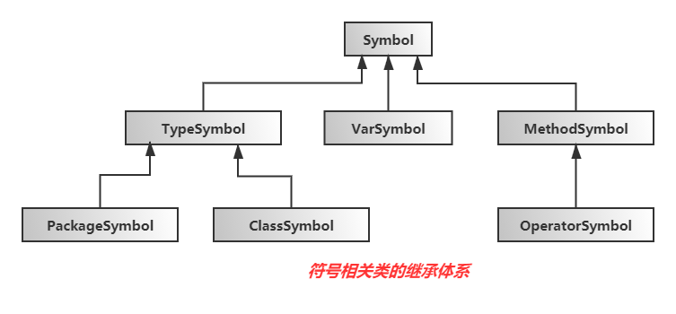

# 符号表的组织

> ***符号表，狭义上可以理解为存储符号的容器，广义上可以理解为环境，不但包含存储符号的容器，而且还存储了一切上下文相关的信息。***
>
> **Javac 在遇到声明或定义时会创建符号，这些符号都绑定了相关的信息，如类型、作用域，而对于方法相关的符号来说，还需要保存形式参数的数量与类型及返回值的类型等信息。**
>
> **将创建好的符号输入到符号表中，这样当发现对符号的引用时，就可以通过符号表查找唯一的符号引用，进而获取更多关于符号的信息。**

## 1. 符号的定义

> **符号通过`com.sun.tools.javac.code.Symbold`类及相关子类来表示。**
>
> 

### 1.1 Symbol类

> **`Symbol`类是所有符号类的父类。**

```java
public abstract class Symbol implements Element {
    public int kind; //参考Kinds
    public long flags_field; //flags of this symbol
    public Name name;
    public Symbol owner;
    public Type type;
    public Completer completer;
}
```

### 1.2 语法树节点与符号对象的联系

> **对于定义及声明的语法树节点对应的实现类来说，会通过定义符号相关的变量来保存具体的符号对象。**

| 实现类                | 变量的定义                       |
| :-------------------- | :------------------------------- |
| **JCCompilationUnit** | **public PackageSymbol package** |
| **JCClasDecl**        | **public ClassSymbol sym**       |
| **JCMethodDecl**      | **public MethodSymbol sym**      |
| **JCVariableDecl**    | **public VarSymbol sym**         |
| **JCNewClass**        | **public Symbol constructor**    |
| **JCAssignOp**        | **public Symbol operator**       |
| **JCUnary**           | **public Symbol operator**       |
| **JCBinary**          | **public Symbol operator**       |
| **JCFieldAccess**     | **public Symbol sym**            |
| **JCIdent**           | **public Symbol sym**            |

### 1.3 Symbole类中定义的kind、flags_field、owner变量

#### 1.3.1 kind变量

> **标识当前符号的具体类型，允许的值已经在`Kinds`类中预先进行了定义。**

| 变量名称 | 变量值            | 描述                                                         |
| -------- | ----------------- | ------------------------------------------------------------ |
| **NIL**  | **0**             | **用在语句及表达式的分析过程中，表示对所分析的语句或表达式没有符号期望** |
| **PCK**  | **1 << 0**        | **用来标识`PackageSymbol`对象，也可用在语句及表达式的分析过程中，表示对所分析的语句或表达式的符号期望为`PackageSymbol`** |
| **TYP**  | **1 << 1**        | **用来标识`ClassSymbol`或`TypeSymbol`对象，也可用在语句及表达式的分析过程中，表示对所分析的语句或表达式的符号期望为`ClassSymbol`或`TypeSymbol`** |
| **VAR**  | **1 << 2**        | **用来标识`VarSymbol`对象，也可用在语句及表达式的分析过程中，表示对所分析的语句或表达式的符号期望为`PackageSymbol`** |
| **VAL**  | **(1<<3) \| VAR** | **用在语句及表达式的分析过程中，表示对所分析的语句或表达式的符号期望为`VarSymbol`或者常量值** |
| **MTH**  | **1 << 4**        | **用来标识`MethodSymobl`或`OperatorMethodSymbol`对象，也可用在语句及表达式的分析过程中，表示对所分析的语句或表达式的符号期望为`MethodSymbol`或`OperatorMethodSymbol`** |
| **ERR**  | **(1 << 5) - 1**  | **用来标识已经错误的符号对象**                               |

